<div align="center">


Universidad Peruana de Ciencias Aplicadas

Carrera de Ingeniería de Software

**1ASI0730-2620** 

** Aplicaciones Web**

NRC 

**16127**

**Informe del AV1**

Docente:
**Oscar Ivan Villafuerte Bazan**

<br>

Equipo:

**VocaFy**

Proyecto:

**NextPath**

<br>

**Integrantes:**

| Código | Apellidos y Nombres |
|---|---|
| U202410420 | Fernando Sebastian Pérez Bellido|
| U202411354 | Joaquin Cruzalegui Herrera |
| U202411261 | Miranda Cordova, Jesus Angel Yvan |
| U20221F887  | Luciana Angelina Ravello Cárdenas |
| U202624323 | Alisee Muriel Torres Juárez |

<br>

**Periodo 202620**

**Septiembre, 2026**

</div>

---

# Registro de Versiones del Informe

<table>
  <tr>
    <th>Versión</th>
    <th>Fecha</th>
    <th>Autor</th>
    <th>Descripción de modificación</th>
  </tr>

  <tr>
    <td><b>Primera Entrega (AV1)</b></td>
    <td>XX/09/2026</td>
    <td>
       <br>
      <br>
      <p></p>
       <br>
      <br>
      <p></p>
     <br>
      <br>
      <p></p>
       <br>
      <br>
      <p></p>
       <br>
    </td>
    <td>
      Capítulo I: 
      Introducción
    <br>
      Capítulo II:
      Requirements Elicitation & Analysis
    <br> 
      Capítulo III: 
      Requirements Specification
    <br>
      Capítulo IV:
        Product Design
    <br>
      Capítulo V:
      Product Implementation, Validation & Deployment
    <br>
    </td>
  </tr>
  </table>

 ---
 # Project Report Collaboration Insights


**Primera Entrega (AV1)**

---
# Student Outcome

El curso contribuye al cumplimiento del Student Outcome ABET:

**ABET – EAC - Student Outcome 3**

**Criterio:** 
*Capacidad de comunicarse efectivamente con un rango de audiencias.*

En el siguiente cuadro se describe las acciones realizadas y enunciados de
conclusiones por parte del grupo, que permiten sustentar el haber alcanzado el logro
del ABET – EAC - Student Outcome 3.

<table>
  <tr>
    <th>Criterio específico</th>
    <th>Acciones realizadas</th>
    <th>Conclusiones</th>
  </tr>
  <tr>
      <td><b>Trabaja en equipo para proporcionar liderazgo en forma conjunta.</b></td>
      <td>
            <b></b><br>
            <u>AV1</u><br>
            <br><br>
            <b></b><br>
            <u>AV1</u><br>
            <br><br>
            <b></b><br>
            <u>AV1</u><br>
            <br><br>
            <b></b><br>
            <u> Joaquin Cruzalegui Herrera AV1: Durante el proyecto NextPath asumí un liderazgo técnico compartido, coordinando con mis compañeros las principales decisiones de diseño del sistema. Guié al equipo en el modelado de los diagramas C4 (Contexto, Contenedores y Componentes) tomando como base nuestro EventStorming. </u><br>
            <br><br>
            <b></b><br>
            <u> Fernando Sebastian Perez Bellido AV1: Realice en conjunto la landing page, diagrama de componentes y parte del capitulo 5</u><br>
            <br><br>
        </td>
        <td>
            <u>AV1: Se dsarrolló hasta el cpitulo 5 en conjunto con la landing page y su despliegue</u><br>
        </td>
    </tr>
      <tr>
      <td><b>Crea un entorno colaborativo e inclusivo, establece metas, planifica tareas y cumple objetivos</b></td>
      <td>
            <b></b><br>
            <u>AV1</u><br>
            <br><br>
            <b></b><br>
            <u>AV1</u><br>
            <br><br>
            <b></b><br>
            <u>AV1</u><br>
            <br><br>
            <b></b><br>
            <u>Joaquin Cruzalegui AV1: Promoví un ambiente de trabajo abierto durante la planificación del Sprint 1, escuchando las propuestas de todos para estimar los Story Points y repartir las tareas de forma justa en la matriz LACX. Participé directamente en organizar las tareas del Sprint Backlog para construir la Landing Page y documentar la arquitectura, fijando metas y fechas claras de entrega. Gracias a la coordinación constante y al apoyo mutuo al revisar el código y los diagramas, logramos realizar grandes avances y desplegar la Landing Page</u><br>
            <br><br>
            <b></b><br>
            <u>Fernando Sebastian Perez Bellido AV1: colaboré en la realización de los diagramas de C4</u><br>
            <br><br>
        </td>
        <td>
            <u>Se dsarrolló hasta el cpitulo 5 en conjunto con la landing page y su despliegue</u><br>
        </td>
    </tr>
</table>

---
# Contenido

# Tabla de Contenidos


- [Capítulo I: Introducción](#capítulo-i-introducción)
  - [1.1. Startup Profile](#11-startup-profile)
    - [1.1.1. Descripción de la Startup](#111-descripción-de-la-startup)
    - [1.1.2. Perfiles de integrantes del equipo](#112-perfiles-de-integrantes-del-equipo)
  - [1.2. Solution Profile](#12-solution-profile)
    - [1.2.1. Antecedentes y problemática](#121-antecedentes-y-problemática)
    - [1.2.2. Lean UX Process](#122-lean-ux-process)
      - [1.2.2.1. Lean UX Problem Statements](#1221-lean-ux-problem-statements)
      - [1.2.2.2. Lean UX Assumptions](#1222-lean-ux-assumptions)
      - [1.2.2.3. Lean UX Hypothesis Statements](#1223-lean-ux-hypothesis-statements)
      - [1.2.2.4. Lean UX Canvas](#1224-lean-ux-canvas)
  - [1.3. Segmentos objetivo](#13-segmentos-objetivo)

- [Capítulo II: Requirements Elicitation & Analysis](#capítulo-ii-requirements-elicitation--analysis)
  - [2.1. Competidores](#21-competidores)
    - [2.1.1. Análisis competitivo](#211-análisis-competitivo)
    - [2.1.2. Estrategias y tácticas frente a competidores](#212-estrategias-y-tácticas-frente-a-competidores)
  - [2.2. Entrevistas](#22-entrevistas)
    - [2.2.1. Diseño de entrevistas](#221-diseño-de-entrevistas)
    - [2.2.2. Registro de entrevistas](#222-registro-de-entrevistas)
    - [2.2.3. Análisis de entrevistas](#223-análisis-de-entrevistas)
  - [2.3. Needfinding](#23-needfinding)
    - [2.3.1. User Personas](#231-user-personas)
    - [2.3.2. User Task Matrix](#232-user-task-matrix)
    - [2.3.3. User Journey Mapping](#233-user-journey-mapping)
    - [2.3.4. Empathy Mapping](#234-empathy-mapping)
  - [2.4. Big Picture Event Storming](#24-big-picture-event-storming)
  - [2.5. Ubiquitous Language](#25-ubiquitous-language)

- [Capítulo III: Requirements Specification](#capítulo-iii-requirements-specification)
  - [3.1. User Stories](#31-user-stories)
  - [3.2. Impact Mapping](#32-impact-mapping)
  - [3.3. Product Backlog](#33-product-backlog)

- [Capítulo IV: Product Design](#capítulo-iv-product-design)
  - [4.1. Style Guidelines](#41-style-guidelines)
    - [4.1.1. General Style Guidelines](#411-general-style-guidelines)
    - [4.1.2. Web Style Guidelines](#412-web-style-guidelines)
  - [4.2. Information Architecture](#42-information-architecture)
    - [4.2.1. Organization Systems](#421-organization-systems)
    - [4.2.2. Labeling Systems](#422-labeling-systems)
    - [4.2.3. SEO Tags and Meta Tags](#423-seo-tags-and-meta-tags)
    - [4.2.4. Searching Systems](#424-searching-systems)
    - [4.2.5. Navigation Systems](#425-navigation-systems)
  - [4.3. Landing Page UI Design](#43-landing-page-ui-design)
    - [4.3.1. Landing Page Wireframe](#431-landing-page-wireframe)
    - [4.3.2. Landing Page Mock-up](#432-landing-page-mock-up)
  - [4.4. Web Applications UX/UI Design](#44-web-applications-uxui-design)
    - [4.4.1. Web Applications Wireframes](#441-web-applications-wireframes)
    - [4.4.2. Web Applications Wireflow Diagrams](#442-web-applications-wireflow-diagrams)
    - [4.4.3. Web Applications Mock-ups](#443-web-applications-mock-ups)
    - [4.4.4. Web Applications User Flow Diagrams](#444-web-applications-user-flow-diagrams)
  - [4.5. Web Applications Prototyping](#45-web-applications-prototyping)
  - [4.6. Domain-Driven Software Architecture](#46-domain-driven-software-architecture)
    - [4.6.1. Design-Level Event Storming](#461-design-level-event-storming)
    - [4.6.2. Software Architecture Context Diagram](#462-software-architecture-context-diagram)
    - [4.6.3. Software Architecture Container Diagrams](#463-software-architecture-container-diagrams)
    - [4.6.4. Software Architecture Components Diagrams](#464-software-architecture-components-diagrams)
  - [4.7. Software Object-Oriented Design](#47-software-object-oriented-design)
    - [4.7.1. Class Diagrams](#471-class-diagrams)
  - [4.8. Database Design](#48-database-design)
    - [4.8.1. Database Diagrams](#481-database-diagrams)

- [Capítulo V: Product Implementation, Validation & Deployment](#capítulo-v-product-implementation-validation--deployment)
  - [5.1. Software Configuration Management](#51-software-configuration-management)
    - [5.1.1. Software Development Environment Configuration](#511-software-development-environment-configuration)
    - [5.1.2. Source Code Management](#512-source-code-management)
    - [5.1.3. Source Code Style Guide & Conventions](#513-source-code-style-guide--conventions)
    - [5.1.4. Software Deployment Configuration](#514-software-deployment-configuration)
  - [5.2. Landing Page, Services & Applications Implementation](#52-landing-page-services--applications-implementation)
    - [5.2.X. Sprint N](#52x-sprint-n)
      - [5.2.X.1. Sprint Planning N](#52x1-sprint-planning-n)
      - [5.2.X.2. Aspect Leaders and Collaborators](#52x2-aspect-leaders-and-collaborators)
      - [5.2.X.3. Sprint Backlog N](#52x3-sprint-backlog-n)
      - [5.2.X.4. Development Evidence for Sprint Review](#52x4-development-evidence-for-sprint-review)
      - [5.2.X.5. Execution Evidence for Sprint Review](#52x5-execution-evidence-for-sprint-review)
      - [5.2.X.6. Services Documentation Evidence for Sprint Review](#52x6-services-documentation-evidence-for-sprint-review)
      - [5.2.X.7. Software Deployment Evidence for Sprint Review](#52x7-software-deployment-evidence-for-sprint-review)
      - [5.2.X.8. Team Collaboration Insights during Sprint](#52x8-team-collaboration-insights-during-sprint)
  - [5.3. Validation Interviews](#53-validation-interviews)
    - [5.3.1. Diseño de Entrevistas](#531-diseño-de-entrevistas)
    - [5.3.2. Registro de Entrevistas](#532-registro-de-entrevistas)
    - [5.3.3. Evaluaciones según heurísticas](#533-evaluaciones-según-heurísticas)
  - [5.4. Video About-the-Product](#54-video-about-the-product)

- [Conclusiones](#conclusiones)
- [Conclusiones y recomendaciones](#conclusiones-y-recomendaciones)
- [Video About-the-Team](#video-about-the-team)
- [Bibliografía](#bibliografía)
- [Anexos](#anexos)

---

# Capítulo I: Introducción

## 1.1. Startup Profile

### 1.1.1. Descripción de la Startup
VocaFy es una aplicación basada en inteligencia artificial, diseñada para ayudar a los estudiantes en la toma de decisiones académicas y profesionales. La aplicación analiza variables cognitivas, emocionales y vocacionales para brindar recomendaciones personalizadas sobre carreras, especializaciones y opciones de formación.
La solución incorpora pruebas interactivas, orientación guiada, simulaciones de trayectoria profesional e información relacionada con el mercado laboral. De esta manera, VocaFy busca proporcionar una herramienta integral que facilite el proceso de elección de una carrera profesional.

### 1.1.2. Perfiles de integrantes del equipo
El equipo de VocaFy está conformado por los siguientes integrantes:

| Código | Apellidos y Nombres |
|---|---|
| U202410420 | Fernando Sebastian Pérez Bellido |
| U202411354 | Joaquin Cruzalegui Herrera |
| U202411261 | Jesus Angel Yvan Miranda |
| U20221F887 | Luciana Angelina Ravello Cárdenas |
| U202624323 | Alisee Muriel Torres Juárez |

## 1.2. Solution Profile

### 1.2.1. Antecedentes y problemática

En los últimos años, la orientación vocacional se ha convertido en un aspecto de creciente interés dentro del ámbito educativo, debido a su influencia directa en la permanencia y el éxito académico. Diversos estudios han evidenciado que un número importante de estudiantes ingresa a la educación superior con dudas respecto a su elección profesional, lo que posteriormente se traduce en deserción, cambios de carrera o insatisfacción con la formación recibida. Aunque existen iniciativas y herramientas digitales orientadas a apoyar este proceso, la mayoría no ofrece un acompañamiento integral ni aprovecha plenamente los avances tecnológicos disponibles, lo que evidencia la necesidad de explorar alternativas más innovadoras y personalizadas.

5W (What, Why, Where, Who, Why)
	
- What?
  Existe una dificultad recurrente en los estudiantes al momento de elegir una carrera o área de formación, debido a la falta de herramientas de orientación vocacional personalizadas y efectivas.
- Why?
  La orientación vocacional tradicional se basa en pruebas estandarizadas y asesorías generales que no consideran integralmente los intereses, habilidades y rasgos de personalidad de cada estudiante, ni las demandas actuales del mercado laboral.
- Where?
  El problema se presenta tanto en instituciones educativas urbanas como rurales, principalmente en los niveles de secundaria y educación superior, donde el acceso a orientación especializada es limitado o generalista.
- Who?
  Afecta principalmente a estudiantes en etapa de decisión o redefinición de carrera, así como a instituciones educativas que enfrentan altos índices de deserción y baja satisfacción estudiantil.
- When?
  Se manifiesta en momentos críticos como la transición del colegio a la universidad o durante los primeros ciclos de formación, etapas en las que los estudiantes experimentan mayor incertidumbre respecto a su futuro profesional.
2H (How, How Much)
- How?
  Los estudiantes suelen apoyarse en test genéricos, consejos de familiares o información dispersa en internet, lo cual no garantiza decisiones sólidas ni alineadas con su perfil.
- How Much?
  El impacto es significativo, reflejándose en altas tasas de deserción universitaria (superiores al 30% en algunos contextos), pérdida de recursos económicos y de tiempo, además de la disminución en la motivación y satisfacción personal de los estudiantes.


### 1.2.2. Lean UX Process

#### 1.2.2.1. Lean UX Problem Statements
Actualmente, se necesita una herramienta que facilite la orientación académica y profesional de los estudiantes. A través de esta aplicación, los jóvenes podrán identificar sus intereses, habilidades y rasgos de personalidad, explorar carreras afines, acceder a información del mercado laboral y simular posibles trayectorias profesionales. Hemos observado un factor crítico que afecta a la población estudiantil, el cual se manifiesta en la desinformación, el uso de pruebas vocacionales genéricas y la falta de acompañamiento personalizado, lo que genera decisiones poco informadas, deserción universitaria y pérdida de recursos. ¿Cómo lograr que más estudiantes elijan carreras adecuadas a su perfil y accedan a una orientación confiable que facilite su futuro académico y profesional?


#### 1.2.2.2. Lean UX Assumptions
- ¿Quién es el usuario?
  Principalmente estudiantes universitarios entre 17 y 25 años y psicólogos que participan en la orientación vocacional.
- ¿Dónde encaja nuestro producto en su trabajo o vida?
  En la toma de decisiones académicas y de orientación vocacional, en momentos críticos como la elección o cambio de carrera.
- ¿Qué problemas tiene nuestro producto y cómo los puede resolver?
  La dificultad para transmitir una certeza completa al elegir una carrera adecuada, la falta de orientación personalizada y el desconocimiento del mercado laboral. El producto resuelve esto con evaluaciones basadas en IA, simulaciones de trayectorias y asesorías personalizadas.
- ¿Cuándo y cómo es usado nuestro producto?
  Durante la transición de colegio a universidad o en los primeros ciclos universitarios, a través de una aplicación web disponible.
- ¿Qué características son importantes?
  Es fácil de utilizar, tiene tests vocacionales interactivos, reportes personalizados, simulación de escenarios profesionales y acceso a información actualizada del mercado laboral.
- ¿Cómo debe verse nuestro producto y cómo comportarse?
  Debe ser intuitivo, atractivo visualmente y confiable, con respuestas rápidas y recomendaciones personalizadas que transmitan seguridad al usuario.


#### 1.2.2.3. Lean UX Hypothesis Statements
Creemos que tanto los estudiantes como los orientadores (psicólogos) valorarán de manera positiva una aplicación que combine inteligencia artificial con orientación vocacional personalizada, especialmente considerando la creciente demanda de decisiones académicas más informadas y alineadas con el mercado laboral actual. Sabremos que esto es cierto cuando observemos que al menos el 80 % de los usuarios califica la utilidad de la app con 4 o más puntos en una escala Likert de 1 a 5, medido mediante encuesta post-uso durante las primeras 4 semanas de implementación.
Creemos que los psicólogos valorarán una aplicación que les permita acceder a reportes vocacionales completos y personalizados de sus pacientes/estudiantes, ya que esto reducirá su tiempo de evaluación y aumentará la precisión en las recomendaciones. Sabremos que esto es cierto cuando el tiempo promedio de evaluación se reduzca en al menos un 30 % y el 75 % de los psicólogos manifieste que la herramienta mejora la calidad de sus sesiones, medido mediante observación directa y encuesta de satisfacción durante un periodo piloto de 2 meses.
Creemos que los estudiantes en etapa de elección o cambio de carrera valorarán una aplicación que les brinde evaluaciones personalizadas y simulaciones de escenarios profesionales, porque esto les permitirá decidir con mayor confianza. Sabremos que esto es cierto cuando el 70 % de los usuarios reportan mayor seguridad en su decisión vocacional y el número de recomendaciones positivas aumenta un 25 % en redes o encuestas, medido durante 8 semanas de prueba beta.


#### 1.2.2.4. Lean UX Canvas

<table>
  <tr>
    <th>1. Business Problem</th>
    <th>5. Solution</th>
    <th>2. Business Outcomes</th>
  </tr>

  <tr>
    <td>
      Los estudiantes presentan dudas al momento de elegir una carrera debido
      a la falta de herramientas personalizadas, información actualizada y
      orientación integral.
    </td>
    <td>
      <ul>
        <li>Aplicación de orientación vocacional basada en IA.</li>
        <li>Tests vocacionales tradicionales.</li>
        <li>Comunidades y grupos de orientación profesional.</li>
      </ul>
    </td>
    <td>
      <ul>
        <li>Obtener reseñas positivas.</li>
        <li>Incrementar las recomendaciones de la plataforma.</li>
        <li>Aumentar el crecimiento de usuarios.</li>
      </ul>
    </td>
  </tr>

  <tr>
    <th>3. Users</th>
    <td rowspan="2"></td>
    <th>4. User Benefits</th>
  </tr>

  <tr>
    <td>
      <ul>
        <li>Estudiantes de 17 a 25 años que están eligiendo o cambiando de carrera.</li>
        <li>Psicólogos educativos de 30 a 60 años.</li>
      </ul>
    </td>
    <td>
      <ul>
        <li>Tomar mejores decisiones académicas y profesionales.</li>
        <li>Mejorar el apoyo psicológico durante la orientación.</li>
        <li>Acceder a mejor información y atención personalizada.</li>
      </ul>
    </td>
  </tr>

  <tr>
    <th>6. Hypothesis</th>
    <th>7. What's the most important thing we need to learn first?</th>
    <th>8. What's the least amount of work we need to do to learn the next most important thing?</th>
  </tr>

  <tr>
    <td>
      Creemos que los estudiantes podrán tomar mejores decisiones académicas
      y profesionales si reciben orientación personalizada mediante una
      aplicación de IA que integre evaluaciones vocacionales, simulaciones e
      información del mercado laboral.
    </td>
    <td>
      <ul>
        <li>Validar si los psicólogos están dispuestos a integrar la herramienta.</li>
        <li>Validar el nivel de confianza de los estudiantes en la IA.</li>
        <li>Determinar si la aplicación reduce la indecisión y ansiedad.</li>
      </ul>
    </td>
    <td>
      Investigar y validar el apoyo de profesionales de psicología en la
      orientación vocacional y realizar pruebas con estudiantes para conocer
      su percepción y confianza en la solución.
    </td>
  </tr>
</table>

## 1.3. Segmentos objetivo
- Estudiantes: 
  - Demografía: Joven entre 17 y 25 años, que inicia sus estudios universitarios. 
  - Necesidades: Decidir qué carrera va a estudiar de manera segura. 
  - Dolor: Dudas en el proceso de elegir una carrera debido a factores externos o diversos intereses. 
- Psicólogos: 
  - Demografía: Adulto entre 30 y 60 años, especialista en psicología educativa o vocacional. 
  - Necesidades: Contar con un recurso complementario que permita evaluar mejor los perfiles de los estudiantes. 
  - Dolor: Limitación de tiempo y recursos para ofrecer orientación personalizada a gran cantidad de estudiantes. 


# Capítulo II: Requirements Elicitation & Analysis

## 2.1. Competidores

### 2.1.1. Análisis competitivo

<table border="1" cellpadding="8" cellspacing="0">
  <thead>
    <tr>
      <th></th>
      <th>VocaFy</th>
      <th>Mi Carrera (MTPE)</th>
      <th>QuEstudiar</th>
      <th>Test vocacional genérico</th>
    </tr>

  <tr align="center" valign="middle">
      <td></td>
      <td>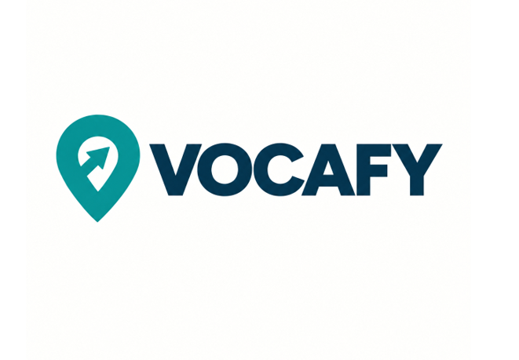</td>
      <td></td>
      <td></td>
      <td></td>
    </tr>
  </thead>
  <tbody>
    <tr>
      <td><strong>Perfil Overview</strong></td>
      <td>Aplicación basada en IA que integra diagnóstico, asesoría, simulación de trayectorias y datos del mercado laboral.</td>
      <td>Plataforma oficial del Ministerio de Trabajo y Promoción del Empleo (Perú), brinda información sobre carreras, demanda laboral y orientación básica.</td>
      <td>Portal privado que centraliza información de universidades y carreras, con tests vocacionales en línea y comparadores de programas.</td>
      <td>Herramientas en línea gratuitas o pagadas, simples, sin personalización, que solo entregan un resultado básico de afinidad.</td>
    </tr>
    <tr>
      <td><strong>Ventaja Competitiva</strong></td>
      <td>Personalización profunda mediante IA + simulación de escenarios profesionales.</td>
      <td>Respaldo oficial, estadísticas laborales confiables.</td>
      <td>Comparación amplia de oferta educativa en universidades e institutos.</td>
      <td>Accesibilidad y rapidez.</td>
    </tr>
    <tr>
      <td colspan="5" align="center"><strong>Perfil de marketing</strong></td>
    </tr>
    <tr>
      <td><strong>Mercado objetivo</strong></td>
      <td>Estudiantes de secundaria, universitarios iniciales y jóvenes en redefinición de carrera (mercado global escalable).</td>
      <td>Estudiantes peruanos de secundaria y universitarios iniciales.</td>
      <td>Jóvenes en etapa de elección de universidad/instituto (Perú y LatAm).</td>
      <td>Público general en internet, sin segmentación.</td>
    </tr>
    <tr>
      <td><strong>Estrategias de marketing</strong></td>
      <td>Estrategia digital con IA, redes sociales, convenios con colegios/universidades, comunidad estudiantil.</td>
      <td>Difusión a través de campañas del MTPE y colegios.</td>
      <td>Marketing digital, SEO, alianzas con universidades privadas.</td>
      <td>Promoción en páginas web y redes sociales como recurso rápido.</td>
    </tr>
    <tr>
      <td><strong>Productos y servicios</strong></td>
      <td>Evaluación integral, test vocacional interactivo, asesoría personalizada, simulación de trayectorias, mercado laboral en tiempo real.</td>
      <td>Información de carreras y ocupaciones, proyecciones laborales, test vocacional básico.</td>
      <td>Test vocacional, buscador de carreras, comparador de universidades.</td>
      <td>Test de orientación simple, a veces descargables o apps.</td>
    </tr>
    <tr>
      <td><strong>Precios y costos</strong></td>
      <td>Freemium (test inicial gratis, módulos avanzados y asesorías premium).</td>
      <td>Gratuito (financiado por el Estado).</td>
      <td>Freemium: test básico gratis, comparadores y guías premium con costo.</td>
      <td>Generalmente gratis, algunos pagos únicos.</td>
    </tr>
    <tr>
      <td><strong>Canales de distribución</strong></td>
      <td>Aplicación móvil, web app, integración con redes sociales y convenios educativos.</td>
      <td>Web oficial del MTPE.</td>
      <td>Página web, redes sociales, buscadores.</td>
      <td>Apps, páginas web independientes.</td>
    </tr>
    <tr>
      <td colspan="5" align="center"><strong>Análisis SWOT</strong></td>
    </tr>
    <tr>
      <td><strong>Fortalezas</strong></td>
      <td>IA, personalización, simulación de escenarios, orientación integral.</td>
      <td>Credibilidad institucional, acceso gratuito.</td>
      <td>Variedad de información sobre universidades y carreras.</td>
      <td>Fácil acceso, sin barreras de entrada.</td>
    </tr>
    <tr>
      <td><strong>Debilidades</strong></td>
      <td>Necesita inversión en IA, posicionamiento de marca y base de datos robusta.</td>
      <td>Limitado a Perú, poca personalización.</td>
      <td>Sesgo hacia universidades afiliadas, enfoque en oferta más que en perfil.</td>
      <td>Muy genérico, poco confiable.</td>
    </tr>
    <tr>
      <td><strong>Oportunidades</strong></td>
      <td>Expandirse a nivel global, alianzas con ministerios, universidades y empleadores.</td>
      <td>Expansión de alcance a colegios, integración con más datos laborales.</td>
      <td>Crecer en Latam, alianzas con más instituciones educativas.</td>
      <td>Mejorar con algoritmos adaptativos.</td>
    </tr>
    <tr>
      <td><strong>Amenazas</strong></td>
      <td>Copia de modelo por competidores con más recursos, resistencia inicial de instituciones tradicionales.</td>
      <td>Baja actualización tecnológica, dependencia de financiamiento estatal.</td>
      <td>Competencia con plataformas internacionales de educación.</td>
      <td>Poca credibilidad frente a usuarios más exigentes.</td>
    </tr>
  </tbody>
</table>

### 2.1.2. Estrategias y tácticas frente a competidores

Tras analizar a la competencia, la estrategia de VocaFy se centra en aprovechar la personalización y el uso de inteligencia artificial como ejes diferenciadores. A diferencia de “Mi Carrera”, que aporta datos oficiales pero limitados al ámbito nacional, Next Path puede ofrecer información actualizada y con un alcance más amplio.

Frente a QuEstudiar, la táctica es marcar la diferencia con un acompañamiento cercano y profundo, que no solo muestre opciones educativas, sino que guíe en el proceso de decisión. Y en relación con los test vocacionales genéricos, la clave está en destacar la confiabilidad y la visión integral, mostrando que la plataforma no se queda en un resultado rápido, sino que acompaña al estudiante en la construcción de su proyecto de vida académico y profesional.

## 2.2. Entrevistas

### 2.2.1. Diseño de entrevistas

Para los estudiantes: 

- ¿Cómo te sientes respecto a elegir una carrera? 
- ¿Te has sentido presionado para tomar una decisión pronto? 
- ¿Sabes qué opciones tienes en cuanto a carreras, o te sientes un poco perdido? 
- ¿Has recibido alguna orientación vocacional en el colegio? ¿Te fue útil?  
- ¿Has usado algún test o herramienta digital para decidir qué estudiar? ¿Qué te parecieron estos test o herramientas? 
- ¿Qué crees que les faltó para ser realmente útiles?  
- ¿Qué opinas de que una aplicación use inteligencia artificial para recomendarte carreras según tus intereses y habilidades? 
- Si pudieras simular cómo sería tu futuro en diferentes carreras, ¿te gustaría? ¿Por qué?  
- ¿Qué otras funciones o información te gustaría que tuviera una aplicación de orientación vocacional? 
- ¿Preferirías que te dé resultados rápidos o que te acompañe paso a paso en el proceso?

<br>

Para los psicólogos:
- ¿Qué métodos o herramientas utiliza actualmente para la orientación vocacional de los estudiantes? 
- ¿Cuáles son las principales dificultades que observa en los estudiantes al elegir una carrera o especialización? 
- ¿Qué limitaciones encuentra en los test vocacionales tradicionales que se suelen aplicar? 
- Desde su experiencia, ¿qué tan importante es considerar factores como intereses, habilidades y rasgos de 
personalidad de manera integrada en este proceso? 
- ¿Cómo percibe la incorporación de inteligencia artificial en la orientación vocacional? ¿Cree que podría 
complementar el trabajo del psicólogo? 
- ¿Cómo reaccionan generalmente los estudiantes frente a evaluaciones vocacionales? ¿Tienden a confiar en los 
resultados? 
- ¿Considera que una aplicación podría servir como apoyo al trabajo profesional, o existe el riesgo de que reemplace 
parte de la labor del psicólogo? 
- ¿Qué tan relevante cree que es incluir información actualizada sobre el mercado laboral en el proceso de 
orientación vocacional? 
- ¿De qué manera una herramienta digital podría mejorar la orientación vocacional y reducir problemas como 
deserción o insatisfacción académica?


### 2.2.2. Registro de entrevistas
**Segmento 1**
**Entrevista 2:**
**Entrevistador(a):** >Jesus Angel Yvan Miranda Cordova

Datos del entrevistado:
  * **Nombre:** Joaquin
  * **Apellido:** zavala
  * **Edad:** 16 años
  * **Distrito:** –
  * **Timing:** 07:07
<p align="center">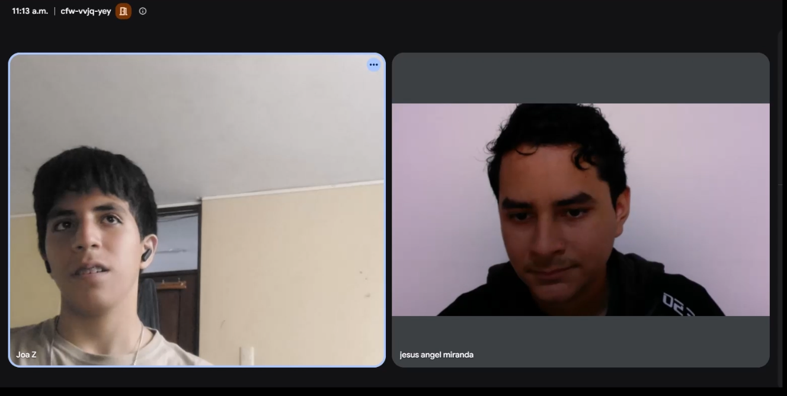</p>
<p align="center"><i>Evidencia de entrevista: Joaquin </i></p>


**Resumen descriptivo:**
La entrevista con Joaquin, un estudiante, muestra que investiga pors su cuenta de forma básica :a dado algunos test por parte de su colegio, pero aun se siente inseguro con respecto a que carreras escoger y a su futuro. El considera que sería útil contar con una plataforma con IA, que le ayude a ampliar sus conocimientos sobre carreras que le podrían interesar.

**Segmento 2**
**Entrevista 1:**
**Entrevistador(a):** >Joaquin Cruzalegui Herrera

Datos del entrevistado:
  * **Nombre:** Silvia
  * **Apellido:** Herrera
  * **Edad:** 49 años
  * **Distrito:** Santiago de Surco
  * **Timing:** 10:30
<p align="center"></p>
<p align="center"><i>Evidencia de entrevista: Silvia </i></p>


**Resumen descriptivo:**
La experta Silvia sostiene que los test vocacionales tradicionales presentan limitaciones importantes en su aplicación. Desde su perspectiva, estas herramientas se encuentran desactualizadas, carecen de pertinencia frente a las carreras emergentes y su formato rígido entrega resultados estáticos que no orientan de manera efectiva al estudiante.

Frente a este escenario, Silvia propone la incorporación de la Inteligencia Artificial (IA) y los medios digitales como un soporte técnico valioso dentro de la orientación. Sin embargo, enfatiza que estas soluciones tecnológicas deben funcionar como herramientas complementarias y nunca como un reemplazo de la labor profesional del psicólogo, debiendo integrarse siempre bajo el marco del criterio, la contención y el acompañamiento clínico.

**Entrevista 1:**
**Entrevistador(a):** >Fernando Sebastián Pérez Bellido

Datos del entrevistado:
  * **Nombre:** Victor
  * **Apellido:** Paz
  * **Edad:** 22 años
  * **Distrito:** Santiago de Surco
  * **Timing:** 17:55
<p align="center"></p>
<p align="center"><i>Evidencia de entrevista: Victor </i></p>


**Resumen descriptivo:**
El psicólogo Víctor Paz señala que los test vocacionales convencionales presentan márgenes de error debido a la indecisión de los estudiantes, la falta de comprensión y las respuestas poco objetivas o deshonestas. Además, resalta la importancia de conectar no solo las habilidades del alumno con las carreras, sino también sus pasiones e intereses profundos con el contexto real del mercado laboral.

Ante este panorama, considera que una aplicación interactiva y las herramientas digitales son apoyos bienvenidos tanto para el estudiante como para el profesional. No obstante, subraya que estas plataformas deben funcionar como un complemento y no como un reemplazo, siendo indispensable la asesoría personalizada del psicólogo para contrastar las respuestas cuantitativas con el testimonio y el sentir genuino de la persona.

**Enlace del video:** [Ver grabación aquí](https://upcedupe-my.sharepoint.com/:v:/g/personal/u202411261_upc_edu_pe/IQC7ixQ3sUbPSo3fHhyXFmKiAdRbTO0KwG08G-QHDK8I3oY?nav=eyJyZWZlcnJhbEluZm8iOnsicmVmZXJyYWxBcHAiOiJTdHJlYW1XZWJBcHAiLCJyZWZlcnJhbFZpZXciOiJTaGFyZURpYWxvZy1MaW5rIiwicmVmZXJyYWxBcHBQbGF0Zm9ybSI6IldlYiIsInJlZmVycmFsTW9kZSI6InZpZXcifX0%3D&e=KupKxd)
### 2.2.3. Análisis de entrevistas
### Análisis General de Entrevistas a Estudiantes
Los estudiantes presentan un panorama de desorientación e inseguridad marcado por la falta de un acompañamiento vocacional efectivo, pues consideran que la orientación brindada por sus colegios y los test convencionales son deficientes, ambiguos o insuficientes para tomar una decisión clara. Esta carencia los expone a una sobrecarga de información confusa y poco confiable en internet, lo que genera estados emocionales de ansiedad y presión frente a su futuro profesional. Ante esta problemática, surge la necesidad de contar con herramientas tecnológicas avanzadas, como NetPath, que entregue respuestas sobre carreras concretas y faciliten un proceso de exploración más estructurado, accesible y adaptado a sus intereses reales. 

### Análisis General de Entrevistas a Expertos (Psicólogos)

A partir de las entrevistas realizadas a los especialistas en orientación vocacional y psicología educativa, Silvia y Víctor Paz, se consolidaron los hallazgos cualitativos respecto al estado actual del proceso de elección de carrera, las limitaciones metodológicas vigentes y las oportunidades de innovación tecnológica.

---

#### 1. Diagnóstico y Limitaciones de los Métodos Tradicionales
* **Herramientas desactualizadas e inflexibles:** Ambos especialistas coinciden en que las pruebas psicométricas convencionales presentan baremos obsoletos frente a las demandas de profesiones híbridas y emergentes.
* **Sesgo de respuesta y fatiga del evaluado:** Se identifica que los cuestionarios extensos y de respuesta forzada generan pérdida de objetividad, respuestas poco honestas o falta de comprensión en las preguntas por parte de los postulantes.
* **Resultados numéricos descontextualizados:** Las evaluaciones estándar arrojan puntuaciones o clasificaciones rígidas que no ofrecen un plan de acción aplicable ni resuelven la indecisión vocacional de fondo.

#### 2. Integración Multidimensional del Perfil del Estudiante
* **Alineación de habilidades y pasiones:** Resulta insuficiente identificar únicamente en qué área académica destaca el alumno; es imprescindible vincular su talento con aquello que realmente le apasiona para prevenir la deserción y la insatisfacción universitaria.
* **Evaluación holística:** Los expertos destacan la necesidad de articular intereses vocacionales, rasgos de personalidad y capacidades cognitivas para contrastarlos de forma realista con las opciones profesionales.
* **Contexto del mercado laboral:** Es prioritario incorporar datos actualizados sobre empleabilidad, remuneración promedio y demanda laboral real del entorno, evitando decisiones basadas exclusivamente en percepciones idealizadas de las carreras.

#### 3. Rol de la Tecnología y la Inteligencia Artificial
* **Acelerador diagnóstico complementario:** La inteligencia artificial y las herramientas digitales representan un soporte valioso para optimizar la recopilación de datos, sintetizar información preliminar y ofrecer accesibilidad multiplataforma.
* **No sustitución del criterio clínico:** Ambos especialistas remarcan que la tecnología no reemplaza la labor del orientador. La intervención profesional es insustituible para la contención emocional, la lectura del contexto sociofamiliar y la contrastación de las métricas cuantitativas con el testimonio y el sentir genuino del estudiante.


## 2.3. Needfinding

### 2.3.1. User Personas

En esta sección se detalla la elaboración de las fichas de User Persona para nuestro proyecto, enfocándose en los segmentos objetivo de Estudiantes y Psicólogos. Estos artefactos sintetizan de forma empática los hallazgos del análisis de entrevistas, como la ansiedad por la incertidumbre vocacional y la obsolescencia de las herramientas tradicionales, junto con las ventajas en el análisis competitivo, orientadas a la personalización profunda y el uso de inteligencia artificial. 


<br>

**Segmento 1: Estudiantes**


<div align="center">
  <br><br>
</div>
<br>

**Segmento 2: Psicólogos Profesionales**
<div align="center">
  <br><br>
</div>

### 2.3.2. User Task Matrix


En esta sección se presenta el User Task Matrix, una herramienta que consolida y prioriza las actividades esenciales que los segmentos objetivo realizan para alcanzar sus metas de orientación. Para este análisis, se consideran nuestros dos segmentos objetivos: el Estudiante y la Psicóloga. A continuación, se considera cada tarea en función de su frecuencia (qué tan seguido se realiza) y su importancia (el impacto que tiene para el usuario).

<table>
  <thead>
    <tr>
      <th rowspan="2">User task</th>
      <th colspan="2">David Herrera (estudiante)</th>
      <th colspan="2">Leopolda Cotrina (psicóloga)</th>
    </tr>
    <tr>
      <th>Frecuencia</th>
      <th>Importancia</th>
      <th>Frecuencia</th>
      <th>Importancia</th>
    </tr>
  </thead>
  <tbody>
    <tr>
      <td>Realizar test vocacional personalizado</td>
      <td>Muy frecuente</td>
      <td>Alta</td>
      <td>Frecuente</td>
      <td>Alta</td>
    </tr>
    <tr>
      <td>Explorar trayectorias profesionales simuladas</td>
      <td>Frecuente</td>
      <td>Alta</td>
      <td>Frecuente</td>
      <td>Media-Alta</td>
    </tr>
    <tr>
      <td>Consultar información del mercado laboral</td>
      <td>Frecuente</td>
      <td>Media</td>
      <td>Muy frecuente</td>
      <td>Alta</td>
    </tr>
    <tr>
      <td>Acceder a asesoría personalizada</td>
      <td>Muy frecuente</td>
      <td>Alta</td>
      <td>Muy frecuente</td>
      <td>Alta</td>
    </tr>
    <tr>
      <td>Generar reportes y recomendaciones adaptativas</td>
      <td>No tan frecuente</td>
      <td>Media</td>
      <td>Muy frecuente</td>
      <td>Alta</td>
    </tr>
  </tbody>
</table>

### 2.3.3. User Journey Mapping

En esta sección se detallan los User Journey Maps en su versión As-Is para los dos segmentos objetivo del proyecto: los estudiantes y los psicólogos vocacionales. El objetivo de estos mapas es ilustrar el viaje de extremo a extremo (end-to-end journey) que experimentan ambos actores en la situación actual, exponiendo las deficiencias y puntos de dolor y que viven los usuarios antes de la existencia de Next Path.

**Segmento 1: Estudiantes**


<div align="center">
  <br><br>
</div>
<br>

**Segmento 2: Psicólogos Profesionales**
<div align="center">
  <br><br>
</div>

### 2.3.4. Empathy Mapping


En esta sección se detalla el diseño y los resultados de los Empathy Maps elaborados para profundizar en la psicología y el entorno de nuestros dos segmentos objetivos: los estudiantes y los psicólogos vocacionales.

**Segmento 1: Estudiantes**


<div align="center">
  <br><br>
</div>
<br>

**Segmento 2: Psicólogos Profesionales**
<div align="center">
  <br><br>
</div>


## 2.4. Big Picture Event Storming

Para lograr una comprensión más detallada y compartida del dominio de negocio, se llevó a cabo una sesión colaborativa de Big Picture Event Storming. Esta técnica de visual de alto nivel nos permitió mapear el sistema completo de la plataforma, identificando los procesos clave que conectan a los estudiantes con los psicólogos a través de nuestra aplicación web. El objetivo principal de esta dinámica fue plasmar de manera gráfica el ciclo de vida completo de la orientación vocacional, desde el registro inicial del usuario hasta la visualización de trayectorias profesionales y la gestión de suscripciones premium, logrando mostrar tanto flujos críticos como oportunidades de mejora en el modelo de negocio.

El desarrollo del Big Picture Event Storming se ejecutó siguiendo una estructura ligeramente secuencial. Primero, fue enfocada en descubrir los eventos de dominio (Domain Events) que cambian el estado del sistema. Después, nos centramos exclusivamente en las interacciones de los dos actores principales (el estudiante y el psicólogo) y los sistemas externos (Pasarela de Pagos y API de IA). También identificamos procesos automáticos que se convirtieron en políticas (policies). Finalmente, se verificó que todo siguiera un flujo coherente y lógico en el contexto de nuestro proyecto.

Para una mejor visualización, se adjunta aquí el [enlace a nuestro tablero de Miro](https://miro.com/welcomeonboard/MEljTU1nWW9FSEhGU2RvcnRPQWJ0VFVxOGlzME9QR2M2a3kxdFRGVWUvUjMzU0RGN21qM3cyWjExV1krQSsvalVoblhxZlplK3BSUU0xV29mTGRtbUY3bEhWV2hMWDN1UjZ1bkVieUYyREtkcnR2eFBCb3dIcFFPRUdMZStsYlBBS2NFMDFkcUNFSnM0d3FEN050ekl3PT0hdjE=?share_link_id=62509929931.).

<br>

<div align="center">
  <br><br>
  <br><br>
  <br><br>
  <br><br>
  <br><br>
  <br><br>
  
</div>

## 2.5. Ubiquitous Language

- **NextPath:** Aplicación web de orientación vocacional que guía a los estudiantes en su elección de carrera mediante tests, simulaciones y datos del mercado laboral.
- **Student (Estudiante):** Primer segmento objetivo de VocaFy, jóvenes en etapa de transición a la educación superior que utilizan la plataforma para definir su ruta profesional.
- **Psychologist (Psicólogo):** Segundo segmento objetivo de VocaFy, profesionales que analizan perfiles, brindan retroalimentación y gestionan sesiones de acompañamiento para los estudiantes.
- **Vocational Test (Test Vocacional):** Evaluación interactiva que identifica los intereses, aptitudes y valores del estudiante.
- **Vocational Profile (Perfil Vocacional):** Conjunto de características cognitivas y emocionales obtenidas a partir de las respuestas del estudiante en los tests.
- **Recommended Career (Carrera Recomendada):** Opción académica sugerida al estudiante por su alto nivel de alineación con su perfil vocacional.
- **Vocational Compatibility (Compatibilidad Vocacional):** Porcentaje que mide la afinidad entre el perfil del estudiante y las exigencias de una carrera específica.
- **Career Trajectory (Trayectoria Profesional):** Proyección de los escenarios académicos y laborales futuros basados en las decisiones de estudio del usuario.
- **Labor Market (Mercado Laboral):** Información sobre la demanda de empleos, proyecciones a 5 años y salarios promedio de las distintas profesiones.
- **Counseling Session (Sesión de Orientación):** Interacción directa en la plataforma entre el psicólogo y el estudiante para resolver dudas y brindar acompañamiento.
- **Evolution Report (Reporte de Evolución):** Documento que agrupa los resultados históricos del estudiante para mostrar cómo cambian sus intereses en el tiempo.
- **Curriculum (Malla Curricular):** Estructura académica que detalla los cursos, tiempos de estudio y requisitos de una carrera en una institución específica.
- **Interest Community (Comunidad de Interés):** Espacio social colaborativo donde estudiantes con afinidades vocacionales similares interactúan y comparten experiencias.
- **Follow-up Reminder (Recordatorio de Seguimiento):** Alerta programada por el psicólogo para asegurar el acompañamiento continuo del estudiante en su proceso de decisión.
- **Premium Subscription (Suscripción Premium):** Nivel de acceso de pago que desbloquea herramientas avanzadas, como simulaciones de trayectorias y asesorías directas.
<br>
<br>
<br>


# Capítulo III: Requirements Specification

## 3.1. User Stories

<!-- HU 01 -->
<table>
  <tbody>
    <tr>
      <td width="20%"><b>USER STORY ID</b></td>
      <td width="30%">HU 01</td>
      <td width="20%"><b>EPIC ID</b></td>
      <td width="30%">E-01</td>
    </tr>
    <tr>
      <td><b>Title:</b></td>
      <td colspan="3">Realizar test vocacional</td>
    </tr>
    <tr>
      <td><b>Description:</b></td>
      <td colspan="3">COMO estudiante QUIERO realizar un test vocacional dentro de la plataforma PARA crear un perfil de intereses y aptitudes con recomendaciones personalizadas.</td>
    </tr>
    <tr>
      <td><b>Acceptance criteria:</b></td>
      <td colspan="3">
        <b>Feature: Test Vocacional Interactivo</b><br><br>
        <b>Scenario 1: Completar test vocacional exitosamente</b><br>
        GIVEN que accedo a la sección de test vocacional,<br>
        WHEN inicio el test y respondo todas las preguntas hasta la última,<br>
        THEN el sistema debe calcular mi perfil vocacional,<br>
        AND mostrar mis resultados con porcentajes por área,<br>
        AND generar una retroalimentación personalizada con recomendaciones de carreras.<br><br>
        <b>Scenario 2: Navegación y guardado de respuestas durante el test</b><br>
        GIVEN que estoy realizando el test vocacional en la pregunta 5 de 20,<br>
        WHEN selecciono la opción 'riesgor',<br>
        THEN el sistema debe llevarme a la pregunta 4 mostrando la opción elegida previamente;<br>
        WHEN cambio mi respuesta y presiono 'Siguiente',<br>
        THEN el sistema guarda la nueva respuesta y me muestra la pregunta 6 con el progreso actualizado.
      </td>
    </tr>
  </tbody>
</table>
<br>

<!-- HU 02 -->
<table>
  <tbody>
    <tr>
      <td width="20%"><b>USER STORY ID</b></td>
      <td width="30%">HU 02</td>
      <td width="20%"><b>EPIC ID</b></td>
      <td width="30%">E-01</td>
    </tr>
    <tr>
      <td><b>Title:</b></td>
      <td colspan="3">Visualizar resultados vocacionales</td>
    </tr>
    <tr>
      <td><b>Description:</b></td>
      <td colspan="3">COMO estudiante QUIERO acceder a los resultados detallados de mis tests vocacionales PARA comprender mis áreas de fortaleza, afinidades e iniciar mi exploración profesional.</td>
    </tr>
    <tr>
      <td><b>Acceptance criteria:</b></td>
      <td colspan="3">
        <b>Feature: Visualización de Resultados Vocacionales</b><br><br>
        <b>Scenario 1: Visualización completa de informe vocacional</b><br>
        GIVEN que he finalizado mi test vocacional,<br>
        WHEN accedo al módulo 'Mis Resultados',<br>
        THEN el sistema me despliega un resumen gráfico por áreas (Artística, Social, Investigativa, etc.),<br>
        AND presenta un desglose de porcentaje de compatibilidad y sugerencias de carrera.
      </td>
    </tr>
  </tbody>
</table>
<br>

<!-- HU 03 -->
<table>
  <tbody>
    <tr>
      <td width="20%"><b>USER STORY ID</b></td>
      <td width="30%">HU 03</td>
      <td width="20%"><b>EPIC ID</b></td>
      <td width="30%">E-01</td>
    </tr>
    <tr>
      <td><b>Title:</b></td>
      <td colspan="3">Realizar test de seguimiento y medir evolución vocacional</td>
    </tr>
    <tr>
      <td><b>Description:</b></td>
      <td colspan="3">COMO estudiante QUIERO realizar tests de seguimiento periódicos PARA medir mi evolución vocacional y ajustar mis decisiones profesionales según mi desarrollo.</td>
    </tr>
    <tr>
      <td><b>Acceptance criteria:</b></td>
      <td colspan="3">
        <b>Feature: Tests de Seguimiento y Evolución</b><br><br>
        <b>Scenario 1: Sugerencia de reevaluación periódica</b><br>
        GIVEN que he completado mi primer test vocacional y han transcurrido 6 meses,<br>
        WHEN ingreso a la plataforma,<br>
        THEN el sistema sugiere realizar un test de seguimiento y despliega una gráfica comparativa con la evaluación anterior.<br><br>
        <b>Scenario 2: Análisis histórico de progreso</b><br>
        GIVEN que he completado múltiples tests vocacionales,<br>
        WHEN accedo a mi historial de evolución,<br>
        THEN el sistema muestra gráficos de progreso por área vocacional y un análisis de consistencia de mis intereses.
      </td>
    </tr>
  </tbody>
</table>
<br>

<!-- HU 04 -->
<table>
  <tbody>
    <tr>
      <td width="20%"><b>USER STORY ID</b></td>
      <td width="30%">HU 04</td>
      <td width="20%"><b>EPIC ID</b></td>
      <td width="30%">E-02</td>
    </tr>
    <tr>
      <td><b>Title:</b></td>
      <td colspan="3">Consultar resultados de estudiantes</td>
    </tr>
    <tr>
      <td><b>Description:</b></td>
      <td colspan="3">COMO psicólogo QUIERO acceder a los resultados vocacionales de mis estudiantes asignados PARA orientarles según sus intereses, habilidades y aptitudes.</td>
    </tr>
    <tr>
      <td><b>Acceptance criteria:</b></td>
      <td colspan="3">
        <b>Feature: Panel de Psicólogo - Consulta de Resultados</b><br><br>
        <b>Scenario 1: Lista de estudiantes asignados y filtro de pendientes</b><br>
        GIVEN que soy un psicólogo autenticado en el sistema,<br>
        WHEN accedo a mi panel de control,<br>
        THEN visualizo la lista de estudiantes a mi cargo con su nombre, curso y fecha del último test,<br>
        AND dispongo de un filtro para identificar a quienes tienen evaluaciones pendientes de revisión.<br><br>
        <b>Scenario 2: Revisión de expediente vocacional de un alumno</b><br>
        GIVEN que me encuentro en la lista de alumnos asignados,<br>
        WHEN selecciono un estudiante específico,<br>
        THEN accedo a su perfil vocacional completo con gráficos comparativos de evolución y un área para agregar observaciones profesionales.
      </td>
    </tr>
  </tbody>
</table>
<br>

<!-- HU 05 -->
<table>
  <tbody>
    <tr>
      <td width="20%"><b>USER STORY ID</b></td>
      <td width="30%">HU 05</td>
      <td width="20%"><b>EPIC ID</b></td>
      <td width="30%">E-02</td>
    </tr>
    <tr>
      <td><b>Title:</b></td>
      <td colspan="3">Programar sesiones de orientación</td>
    </tr>
    <tr>
      <td><b>Description:</b></td>
      <td colspan="3">COMO psicólogo QUIERO agendar sesiones de orientación individual o grupal con los estudiantes PARA brindar acompañamiento personalizado según los resultados del test.</td>
    </tr>
    <tr>
      <td><b>Acceptance criteria:</b></td>
      <td colspan="3">
        <b>Feature: Gestión y Agendamiento de Sesiones de Orientación</b><br><br>
        <b>Scenario 1: Crear sesión individual basada en resultados</b><br>
        GIVEN que reviso el perfil vocacional de un estudiante,<br>
        WHEN identifico la necesidad de una reunión individual,<br>
        THEN puedo agendar la sesión con fecha, hora y observaciones preliminares, enviando una notificación automática al alumno.<br><br>
        <b>Scenario 2: Organizar sesión grupal por afinidad vocacional</b><br>
        GIVEN que identifico un grupo de estudiantes con perfiles afines,<br>
        WHEN selecciono 'Crear sesión grupal',<br>
        THEN el sistema sugiere agrupamientos por compatibilidad y me permite definir fecha, hora y objetivo en común para todos los convocados.
      </td>
    </tr>
  </tbody>
</table>
<br>

<!-- HU 06 -->
<table>
  <tbody>
    <tr>
      <td width="20%"><b>USER STORY ID</b></td>
      <td width="30%">HU 06</td>
      <td width="20%"><b>EPIC ID</b></td>
      <td width="30%">E-02</td>
    </tr>
    <tr>
      <td><b>Title:</b></td>
      <td colspan="3">Enviar recomendaciones personalizadas</td>
    </tr>
    <tr>
      <td><b>Description:</b></td>
      <td colspan="3">COMO psicólogo QUIERO enviar observaciones y recomendaciones vocacionales a cada estudiante PARA apoyar su proceso de toma de decisiones profesionales.</td>
    </tr>
    <tr>
      <td><b>Acceptance criteria:</b></td>
      <td colspan="3">
        <b>Feature: Sistema de Recomendaciones Vocacionales Directas</b><br><br>
        <b>Scenario 1: Redactar y adjuntar recomendaciones</b><br>
        GIVEN que he evaluado los resultados de un alumno,<br>
        WHEN redacto observaciones específicas y selecciono carreras o recursos de apoyo,<br>
        THEN puedo enviar la recomendación como mensaje directamente al perfil del estudiante en la plataforma.<br><br>
        <b>Scenario 2: Seguimiento del estado de la recomendación</b><br>
        GIVEN que he enviado recomendaciones a varios alumnos,<br>
        WHEN accedo a mi historial de comunicaciones,<br>
        THEN puedo visualizar el estado de cada mensaje (enviado, leído)
      </td>
    </tr>
  </tbody>
</table>
<br>

<!-- HU 07 -->
<table>
  <tbody>
    <tr>
      <td width="20%"><b>USER STORY ID</b></td>
      <td width="30%">HU 07</td>
      <td width="20%"><b>EPIC ID</b></td>
      <td width="30%">E-02</td>
    </tr>
    <tr>
      <td><b>Title:</b></td>
      <td colspan="3">Programar recordatorios de seguimiento vocacional</td>
    </tr>
    <tr>
      <td><b>Description:</b></td>
      <td colspan="3">COMO psicólogo QUIERO programar recordatorios automáticos de seguimiento PARA asegurar el acompañamiento continuo de los estudiantes en su proceso de elección.</td>
    </tr>
    <tr>
      <td><b>Acceptance criteria:</b></td>
      <td colspan="3">
        <b>Feature: Configuración de Recordatorios de Seguimiento</b><br><br>
        <b>Scenario 1: Establecer alertas de seguimiento por alumno</b><br>
        GIVEN que accedo al módulo de configuración de seguimiento,<br>
        WHEN defino la frecuencia de recordatorios y fechas clave para reevaluaciones,<br>
        THEN el sistema programa las alertas automáticas en la agenda del psicólogo y del estudiante.<br><br>
        <b>Scenario 2: Notificación de alumno prioritario</b><br>
        GIVEN que el sistema detecta que un estudiante requiere seguimiento periódico,<br>
        WHEN se cumple la fecha programada,<br>
        THEN recibo una alerta prioritaria con enlace rápido a su expediente y opciones de contacto inmediato.
      </td>
    </tr>
  </tbody>
</table>
<br>

<!-- HU 08 -->
<table>
  <tbody>
    <tr>
      <td width="20%"><b>USER STORY ID</b></td>
      <td width="30%">HU 08</td>
      <td width="20%"><b>EPIC ID</b></td>
      <td width="30%">E-02</td>
    </tr>
    <tr>
      <td><b>Title:</b></td>
      <td colspan="3">Generar reportes estadísticos de orientación vocacional</td>
    </tr>
    <tr>
      <td><b>Description:</b></td>
      <td colspan="3">COMO psicólogo QUIERO generar reportes estadísticos sobre los resultados de los estudiantes PARA identificar patrones grupales y adaptar las estrategias de orientación.</td>
    </tr>
    <tr>
      <td><b>Acceptance criteria:</b></td>
      <td colspan="3">
        <b>Feature: Reportes Estadísticos de Orientación Agregada</b><br><br>
        <b>Scenario 1: Generar consolidado estadístico por grupo</b><br>
        GIVEN que gestiono múltiples alumnos,<br>
        WHEN solicito un reporte estadístico grupal,<br>
        THEN el sistema genera datos consolidados sobre la distribución de perfiles, carreras más solicitadas y gráficos comparativos por cohorte.
      </td>
    </tr>
  </tbody>
</table>
<br>

<!-- HU 09 -->
<table>
  <tbody>
    <tr>
      <td width="20%"><b>USER STORY ID</b></td>
      <td width="30%">HU 09</td>
      <td width="20%"><b>EPIC ID</b></td>
      <td width="30%">E-03</td>
    </tr>
    <tr>
      <td><b>Title:</b></td>
      <td colspan="3">Acceder a recursos vocacionales actualizados</td>
    </tr>
    <tr>
      <td><b>Description:</b></td>
      <td colspan="3">COMO psicólogo QUIERO acceder a una biblioteca de recursos vocacionales actualizados PARA apoyar a mis estudiantes con material informativo de calidad.</td>
    </tr>
    <tr>
      <td><b>Acceptance criteria:</b></td>
      <td colspan="3">
        <b>Feature: Biblioteca de Recursos Vocacionales</b><br><br>
        <b>Scenario 1: Consulta y filtrado de material informativo</b><br>
        GIVEN que accedo a la sección 'Recursos Vocacionales',<br>
        WHEN filtro por categoría (guías, talleres, libros, videos),<br>
        THEN el sistema muestra el listado de materiales ordenados por fecha de actualización.<br><br>
        <b>Scenario 2: Descarga o lectura en línea</b><br>
        GIVEN que he seleccionado un recurso relevante,<br>
        WHEN presiono 'Descargar' o 'Ver en línea',<br>
        THEN el sistema me permite guardar el documento PDF o visualizarlo directamente.
      </td>
    </tr>
  </tbody>
</table>
<br>

<!-- HU 10 -->
<table>
  <tbody>
    <tr>
      <td width="20%"><b>USER STORY ID</b></td>
      <td width="30%">HU 10</td>
      <td width="20%"><b>EPIC ID</b></td>
      <td width="30%">E-03</td>
    </tr>
    <tr>
      <td><b>Title:</b></td>
      <td colspan="3">Obtener reportes de orientación por grupo de estudiantes</td>
    </tr>
    <tr>
      <td><b>Description:</b></td>
      <td colspan="3">COMO psicólogo QUIERO recibir reportes vocacionales grupales por rango de fecha PARA analizar tendencias del alumnado y planificar intervenciones.</td>
    </tr>
    <tr>
      <td><b>Acceptance criteria:</b></td>
      <td colspan="3">
        <b>Feature: Reportes de Orientación Grupal</b><br><br>
        <b>Scenario 1: Generación de informe por grupo y fechas</b><br>
        GIVEN que accedo a la pestaña 'Reportes Grupales',<br>
        WHEN selecciono un grupo de estudiantes y un rango de fechas,<br>
        THEN el sistema genera un resumen con la distribución de habilidades y carreras afines.<br><br>
        <b>Scenario 2: Exportación del informe grupal</b><br>
        GIVEN que el informe ha sido generado,<br>
        WHEN hago clic en 'Exportar',<br>
        THEN el sistema descarga el documento estructurado en formato PDF o Excel.
      </td>
    </tr>
  </tbody>
</table>

<!-- HU 11 -->
<table>
  <tbody>
    <tr>
      <td width="20%"><b>USER STORY ID</b></td>
      <td width="30%">HU 11</td>
      <td width="20%"><b>EPIC ID</b></td>
      <td width="30%">E-03</td>
    </tr>
    <tr>
      <td><b>Title:</b></td>
      <td colspan="3">Recomendar actividades personalizadas</td>
    </tr>
    <tr>
      <td><b>Description:</b></td>
      <td colspan="3">COMO psicólogo QUIERO sugerir actividades específicas según el perfil vocacional del estudiante PARA reforzar sus áreas de mayor afinidad.</td>
    </tr>
    <tr>
      <td><b>Acceptance criteria:</b></td>
      <td colspan="3">
        <b>Feature: Asignación de Actividades Recomendadas</b><br><br>
        <b>Scenario 1: Sugerencia automática y validación del psicólogo</b><br>
        GIVEN que reviso el perfil de un estudiante,<br>
        WHEN accedo al módulo de sugerencias de actividades,<br>
        THEN el sistema me propone guías o ejercicios acordes a sus intereses y puedo modificarlos antes de enviárselos.<br><br>
        <b>Scenario 2: Notificación de actividad asignada</b><br>
        GIVEN que he validado la actividad recomendada,<br>
        WHEN selecciono 'Enviar a estudiante',<br>
        THEN el sistema le notifica inmediatamente con el enlace directo al recurso.
      </td>
    </tr>
  </tbody>
</table>
<br>

<!-- HU 12 -->
<table>
  <tbody>
    <tr>
      <td width="20%"><b>USER STORY ID</b></td>
      <td width="30%">HU 12</td>
      <td width="20%"><b>EPIC ID</b></td>
      <td width="30%">E-04</td>
    </tr>
    <tr>
      <td><b>Title:</b></td>
      <td colspan="3">Evaluar el progreso vocacional del estudiante</td>
    </tr>
    <tr>
      <td><b>Description:</b></td>
      <td colspan="3">COMO psicólogo QUIERO evaluar el progreso del estudiante basándome en sus resultados históricos PARA orientarlo adecuadamente en futuras sesiones.</td>
    </tr>
    <tr>
      <td><b>Acceptance criteria:</b></td>
      <td colspan="3">
        <b>Feature: Evaluación del Progreso e Histórico</b><br><br>
        <b>Scenario 1: Consulta de reportes históricos e IA</b><br>
        GIVEN que accedo al expediente del alumno,<br>
        WHEN consulto sus reportes históricos de pruebas y diagnósticos,<br>
        THEN el sistema me despliega la evolución en áreas de interés, habilidades y nivel de certeza vocacional.<br><br>
        <b>Scenario 2: Registro de observaciones en la ficha</b><br>
        GIVEN que culmino una sesión de orientación,<br>
        WHEN agrego mis notas clínicas en su ficha,<br>
        THEN el sistema almacena la entrada asociándola a la fecha de la sesión.
      </td>
    </tr>
  </tbody>
</table>
<br>

<!-- HU 13 -->
<table>
  <tbody>
    <tr>
      <td width="20%"><b>USER STORY ID</b></td>
      <td width="30%">HU 13</td>
      <td width="20%"><b>EPIC ID</b></td>
      <td width="30%">E-04</td>
    </tr>
    <tr>
      <td><b>Title:</b></td>
      <td colspan="3">Recibir alertas de próximas sesiones</td>
    </tr>
    <tr>
      <td><b>Description:</b></td>
      <td colspan="3">COMO psicólogo QUIERO recibir notificaciones de mis próximas sesiones programadas PARA organizar eficientemente mi agenda de atención.</td>
    </tr>
    <tr>
      <td><b>Acceptance criteria:</b></td>
      <td colspan="3">
        <b>Feature: Sistema de Alertas y Notificación de Citas</b><br><br>
        <b>Scenario 1: Recordatorio diario de agenda</b><br>
        GIVEN que tengo citas agendadas para la jornada,<br>
        WHEN inicia el día laboral,<br>
        THEN el sistema me envía una alerta con el resumen de estudiantes a atender y sus horarios.<br><br>
        <b>Scenario 2: Alerta previa a la reunión</b><br>
        GIVEN que falta menos de 1 hora para una sesión,<br>
        WHEN se cumple el tiempo,<br>
        THEN recibo un aviso emergente con la liga de la sesión y el perfil del alumno.
      </td>
    </tr>
  </tbody>
</table>
<br>

<!-- HU 14 -->
<table>
  <tbody>
    <tr>
      <td width="20%"><b>USER STORY ID</b></td>
      <td width="30%">HU 14</td>
      <td width="20%"><b>EPIC ID</b></td>
      <td width="30%">E-04</td>
    </tr>
    <tr>
      <td><b>Title:</b></td>
      <td colspan="3">Generar reportes psicológicos automáticos</td>
    </tr>
    <tr>
      <td><b>Description:</b></td>
      <td colspan="3">COMO psicólogo QUIERO generar reportes automáticos sobre los perfiles de los estudiantes PARA facilitar la evaluación profesional y el archivo clínico.</td>
    </tr>
    <tr>
      <td><b>Acceptance criteria:</b></td>
      <td colspan="3">
        <b>Feature: Generación de Informes Psicológicos Automáticos</b><br><br>
        <b>Scenario 1: Consolidación de informe profesional</b><br>
        GIVEN que selecciono a un estudiante con evaluaciones completas,<br>
        WHEN presiono 'Generar Informe Psicológico',<br>
        THEN el sistema integra los resultados de las pruebas, observaciones del profesional y tendencias en un archivo exportable.
      </td>
    </tr>
  </tbody>
</table>
<br>

<!-- HU 15 -->
<table>
  <tbody>
    <tr>
      <td width="20%"><b>USER STORY ID</b></td>
      <td width="30%">HU 15</td>
      <td width="20%"><b>EPIC ID</b></td>
      <td width="30%">E-05</td>
    </tr>
    <tr>
      <td><b>Title:</b></td>
      <td colspan="3">Búsqueda con filtros inteligentes</td>
    </tr>
    <tr>
      <td><b>Description:</b></td>
      <td colspan="3">COMO estudiante QUIERO filtrar carreras por área, duración y modalidad PARA identificar opciones alineadas a mis preferencias.</td>
    </tr>
    <tr>
      <td><b>Acceptance criteria:</b></td>
      <td colspan="3">
        <b>Feature: Explorador de Carreras con Filtros</b><br><br>
        <b>Scenario 1: Aplicar filtros combinados</b><br>
        GIVEN que me encuentro en el explorador de carreras,<br>
        WHEN selecciono los filtros de 'Área: Creativa', 'Duración: 5 años' y 'Modalidad: Presencial',<br>
        THEN el sistema muestra únicamente las carreras que cumplen estrictamente todos los parámetros.<br><br>
        <b>Scenario 2: Limpiar o reiniciar filtros</b><br>
        GIVEN que tengo filtros aplicados,<br>
        WHEN presiono 'Reiniciar filtros',<br>
        THEN el sistema restablece la búsqueda y despliega el catálogo completo.
      </td>
    </tr>
  </tbody>
</table>
<br>

<!-- HU 16 -->
<table>
  <tbody>
    <tr>
      <td width="20%"><b>USER STORY ID</b></td>
      <td width="30%">HU 16</td>
      <td width="20%"><b>EPIC ID</b></td>
      <td width="30%">E-05</td>
    </tr>
    <tr>
      <td><b>Title:</b></td>
      <td colspan="3">Visualizar ficha detallada de carrera</td>
    </tr>
    <tr>
      <td><b>Description:</b></td>
      <td colspan="3">COMO estudiante QUIERO acceder a la ficha completa de cada carrera PARA conocer su malla curricular, campo laboral y empleabilidad.</td>
    </tr>
    <tr>
      <td><b>Acceptance criteria:</b></td>
      <td colspan="3">
        <b>Feature: Ficha Técnica de Carrera Profesional</b><br><br>
        <b>Scenario 1: Detalle de malla y mercado laboral</b><br>
        GIVEN que exploro el catálogo de carreras,<br>
        WHEN hago clic sobre una carrera (ej. 'Diseño Gráfico'),<br>
        THEN el sistema me muestra la duración, plan de estudios por semestre, universidades que la imparten, campo laboral y rango salarial promedio.
      </td>
    </tr>
  </tbody>
</table>
<br>

<!-- HU 17 -->
<table>
  <tbody>
    <tr>
      <td width="20%"><b>USER STORY ID</b></td>
      <td width="30%">HU 17</td>
      <td width="20%"><b>EPIC ID</b></td>
      <td width="30%">E-05</td>
    </tr>
    <tr>
      <td><b>Title:</b></td>
      <td colspan="3">Mostrar compatibilidad vocacional</td>
    </tr>
    <tr>
      <td><b>Description:</b></td>
      <td colspan="3">COMO estudiante QUIERO ver el porcentaje de compatibilidad entre mi perfil vocacional y cada carrera PARA priorizar mis opciones.</td>
    </tr>
    <tr>
      <td><b>Acceptance criteria:</b></td>
      <td colspan="3">
        <b>Feature: Indicador de Compatibilidad Vocacional</b><br><br>
        <b>Scenario 1: Cálculo de compatibilidad basado en test</b><br>
        GIVEN que he completado mi test vocacional,<br>
        WHEN navego por las fichas de carreras,<br>
        THEN el sistema muestra un distintivo visual con el porcentaje de compatibilidad (ej. '88% Compatible').
      </td>
    </tr>
  </tbody>
</table>
<br>

<!-- HU 18 -->
<table>
  <tbody>
    <tr>
      <td width="20%"><b>USER STORY ID</b></td>
      <td width="30%">HU 18</td>
      <td width="20%"><b>EPIC ID</b></td>
      <td width="30%">E-05</td>
    </tr>
    <tr>
      <td><b>Title:</b></td>
      <td colspan="3">Comparar carreras seleccionadas</td>
    </tr>
    <tr>
      <td><b>Description:</b></td>
      <td colspan="3">COMO estudiante QUIERO comparar carreras seleccionadas en una tabla PARA evaluar diferencias clave en duración, costos y empleabilidad.</td>
    </tr>
    <tr>
      <td><b>Acceptance criteria:</b></td>
      <td colspan="3">
        <b>Feature: Matriz Comparativa de Carreras</b><br><br>
        <b>Scenario 1: Comparación lado a lado</b><br>
        GIVEN que he marcado dos carreras de mi interés,<br>
        WHEN presiono 'Comparar',<br>
        THEN el sistema genera una tabla comparativa con duración, requisitos, oferta académica y porcentaje de afinidad.<br><br>
        <b>Scenario 2: Límite de carreras a comparar</b><br>
        GIVEN que intento seleccionar una cuarta carrera para comparar,<br>
        WHEN sobrepaso el límite máximo de 3,<br>
        THEN el sistema muestra un aviso indicando que solo es posible comparar hasta 3 opciones a la vez.
      </td>
    </tr>
  </tbody>
</table>
<br>

<!-- HU 19 -->
<table>
  <tbody>
    <tr>
      <td width="20%"><b>USER STORY ID</b></td>
      <td width="30%">HU 19</td>
      <td width="20%"><b>EPIC ID</b></td>
      <td width="30%">E-05</td>
    </tr>
    <tr>
      <td><b>Title:</b></td>
      <td colspan="3">Guardar carreras favoritas</td>
    </tr>
    <tr>
      <td><b>Description:</b></td>
      <td colspan="3">COMO estudiante QUIERO guardar carreras en mi lista de favoritas PARA revisarlas posteriormente en mi panel.</td>
    </tr>
    <tr>
      <td><b>Acceptance criteria:</b></td>
      <td colspan="3">
        <b>Feature: Gestión de Carreras Favoritas</b><br><br>
        <b>Scenario 1: Agregar a favoritos</b><br>
        GIVEN que visualizo una carrera,<br>
        WHEN presiono el icono de 'Favorito',<br>
        THEN el sistema la almacena en mi lista personal.<br><br>
        <b>Scenario 2: Remover de favoritos</b><br>
        GIVEN que reviso mi lista de favoritos,<br>
        WHEN presiono 'Quitar de favoritos',<br>
        THEN la carrera es removida de mi selección.
      </td>
    </tr>
  </tbody>
</table>
<br>

<!-- HU 20 -->
<table>
  <tbody>
    <tr>
      <td width="20%"><b>USER STORY ID</b></td>
      <td width="30%">HU 20</td>
      <td width="20%"><b>EPIC ID</b></td>
      <td width="30%">E-05</td>
    </tr>
    <tr>
      <td><b>Title:</b></td>
      <td colspan="3">Simular futuro profesional según perfil vocacional</td>
    </tr>
    <tr>
      <td><b>Description:</b></td>
      <td colspan="3">COMO estudiante QUIERO acceder a una simulación de mi futuro profesional mediante un botón en el panel de la carrera PARA visualizar mi desarrollo y proyección laboral en correlación con mi perfil vocacional.</td>
    </tr>
    <tr>
      <td><b>Acceptance criteria:</b></td>
      <td colspan="3">
        <b>Feature: Simulación de Proyección Futura Profesional</b><br><br>
        <b>Scenario 1: Acceso exitoso a la simulación con perfil previo</b><br>
        GIVEN que soy un estudiante autenticado y he completado al menos un test vocacional,<br>
        WHEN accedo a la ficha detallada de una carrera y presiono el botón 'Simular mi futuro profesional',<br>
        THEN el sistema procesa la correlación entre la carrera y mi historial vocacional,<br>
        AND muestra una interfaz interactiva con la proyección de mi futuro profesional (entorno laboral, roles recomendados y nivel de afinidad).<br><br>
        <b>Scenario 2: Restricción por falta de historial vocacional</b><br>
        GIVEN que soy un estudiante autenticado y NO he realizado ningún test vocacional,<br>
        WHEN accedo a la ficha de una carrera e intento presionar el botón 'Simular mi futuro profesional',<br>
        THEN el sistema inhabilita la función o muestra una alerta: 'Debes realizar al menos un test vocacional para generar tu perfil antes de acceder a la simulación',<br>
        AND proporciona un enlace directo a la sección de Tests Vocacionales.
      </td>
    </tr>
  </tbody>
</table>

<!-- HU 21 -->
<table>
  <tbody>
    <tr>
      <td width="20%"><b>USER STORY ID</b></td>
      <td width="30%">HU 21</td>
      <td width="20%"><b>EPIC ID</b></td>
      <td width="30%">E-06</td>
    </tr>
    <tr>
      <td><b>Title:</b></td>
      <td colspan="3">Visualizar dashboard de progreso</td>
    </tr>
    <tr>
      <td><b>Description:</b></td>
      <td colspan="3">COMO estudiante QUIERO visualizar un panel con mi progreso vocacional y próximos pasos PARA tener claridad sobre mi avance en la plataforma.</td>
    </tr>
    <tr>
      <td><b>Acceptance criteria:</b></td>
      <td colspan="3">
        <b>Feature: Dashboard de Progreso Estudiantil</b><br><br>
        <b>Scenario 1: Resumen general de tareas e hitos</b><br>
        GIVEN que he completado algunas actividades (tests, lecturas),<br>
        WHEN accedo a 'Mi Progreso',<br>
        THEN el sistema grafica mi porcentaje de avance total, tareas pendientes y siguientes hitos sugeridos.
      </td>
    </tr>
  </tbody>
</table>
<br>

<!-- HU 22 -->
<table>
  <tbody>
    <tr>
      <td width="20%"><b>USER STORY ID</b></td>
      <td width="30%">HU 22</td>
      <td width="20%"><b>EPIC ID</b></td>
      <td width="30%">E-06</td>
    </tr>
    <tr>
      <td><b>Title:</b></td>
      <td colspan="3">Generar plan vocacional personalizado</td>
    </tr>
    <tr>
      <td><b>Description:</b></td>
      <td colspan="3">COMO estudiante QUIERO generar un plan con tareas y fechas basadas en mis resultados e intereses PARA seguir una ruta organizada.</td>
    </tr>
    <tr>
      <td><b>Acceptance criteria:</b></td>
      <td colspan="3">
        <b>Feature: Plan Vocacional Dinámico</b><br><br>
        <b>Scenario 1: Creación automática de hoja de ruta</b><br>
        GIVEN que he completado mi test y seleccionado carreras favoritas,<br>
        WHEN solicito 'Generar Plan Vocacional',<br>
        THEN el sistema crea una lista de tareas cronológicas con fechas límite (ej. explorar universidades, solicitar cita).<br><br>
        <b>Scenario 2: Reajuste automático del plan</b><br>
        GIVEN que he actualizado mi lista de carreras favoritas o intereses,<br>
        WHEN accedo nuevamente a mi plan,<br>
        THEN el sistema recalcula automáticamente las prioridades, tareas y fechas.
      </td>
    </tr>
  </tbody>
</table>
<br>

<!-- HU 23 -->
<table>
  <tbody>
    <tr>
      <td width="20%"><b>USER STORY ID</b></td>
      <td width="30%">HU 23</td>
      <td width="20%"><b>EPIC ID</b></td>
      <td width="30%">E-06</td>
    </tr>
    <tr>
      <td><b>Title:</b></td>
      <td colspan="3">Recibir recordatorios automáticos</td>
    </tr>
    <tr>
      <td><b>Description:</b></td>
      <td colspan="3">COMO estudiante QUIERO recibir recordatorios automáticos sobre mis tareas vocacionales PARA cumplir mis plazos establecidos.</td>
    </tr>
    <tr>
      <td><b>Acceptance criteria:</b></td>
      <td colspan="3">
        <b>Feature: Notificaciones de Plan Vocacional</b><br><br>
        <b>Scenario 1: Aviso de tarea próxima a vencer</b><br>
        GIVEN que tengo una tarea en mi plan con fecha límite cercana,<br>
        WHEN faltan 24 horas,<br>
        THEN el sistema me envía una notificación push/correo con los detalles del pendiente.
      </td>
    </tr>
  </tbody>
</table>
<br>

<!-- HU 24 -->
<table>
  <tbody>
    <tr>
      <td width="20%"><b>USER STORY ID</b></td>
      <td width="30%">HU 24</td>
      <td width="20%"><b>EPIC ID</b></td>
      <td width="30%">E-06</td>
    </tr>
    <tr>
      <td><b>Title:</b></td>
      <td colspan="3">Revisar historial de logros</td>
    </tr>
    <tr>
      <td><b>Description:</b></td>
      <td colspan="3">COMO estudiante QUIERO revisar mi historial de logros y hitos completados PARA reconocer mi avance personal en la orientación.</td>
    </tr>
    <tr>
      <td><b>Acceptance criteria:</b></td>
      <td colspan="3">
        <b>Feature: Historial de Logros e Hitos Completados</b><br><br>
        <b>Scenario 1: Consulta de bitácora de metas</b><br>
        GIVEN que he completado diversas etapas del proceso,<br>
        WHEN accedo a 'Historial de Logros',<br>
        THEN el sistema despliega la lista de hitos alcanzados indicando la fecha de cumplimiento y medalla obtenida.
      </td>
    </tr>
  </tbody>
</table>
<br>

<!-- HU 25 -->
<table>
  <tbody>
    <tr>
      <td width="20%"><b>USER STORY ID</b></td>
      <td width="30%">HU 25</td>
      <td width="20%"><b>EPIC ID</b></td>
      <td width="30%">E-07</td>
    </tr>
    <tr>
      <td><b>Title:</b></td>
      <td colspan="3">Chat en tiempo real con psicólogo</td>
    </tr>
    <tr>
      <td><b>Description:</b></td>
      <td colspan="3">COMO estudiante QUIERO iniciar un chat en tiempo real con un psicólogo PARA resolver dudas inmediatas sobre mis resultados vocacionales.</td>
    </tr>
    <tr>
      <td><b>Acceptance criteria:</b></td>
      <td colspan="3">
        <b>Feature: Chat en Vivo de Asesoría Vocacional</b><br><br>
        <b>Scenario 1: Iniciar conversación con profesional disponible</b><br>
        GIVEN que reviso mis resultados de test,<br>
        WHEN presiono 'Hablar con un psicólogo',<br>
        THEN el sistema abre una ventana de mensajería en directo con el profesional asignado.<br><br>
        <b>Scenario 2: Notificación de nuevo mensaje en chat</b><br>
        GIVEN que mantengo un chat abierto o en segundo plano,<br>
        WHEN el psicólogo responde,<br>
        THEN recibo una alerta sonora y emergente en pantalla en tiempo real.
      </td>
    </tr>
  </tbody>
</table>
<br>

<!-- HU 26 -->
<table>
  <tbody>
    <tr>
      <td width="20%"><b>USER STORY ID</b></td>
      <td width="30%">HU 26</td>
      <td width="20%"><b>EPIC ID</b></td>
      <td width="30%">E-07</td>
    </tr>
    <tr>
      <td><b>Title:</b></td>
      <td colspan="3">Feedback inmediato sobre resultados del test</td>
    </tr>
    <tr>
      <td><b>Description:</b></td>
      <td colspan="3">COMO estudiante QUIERO recibir retroalimentación automática al terminar mi test PARA comprender mis fortalezas y solicitar asesoría profesional.</td>
    </tr>
    <tr>
      <td><b>Acceptance criteria:</b></td>
      <td colspan="3">
        <b>Feature: Retroalimentación Inmediata de Diagnóstico</b><br><br>
        <b>Scenario 1: Despliegue de resumen interpretativo</b><br>
        GIVEN que finalizo la última pregunta de la prueba,<br>
        WHEN se procesan los datos,<br>
        THEN el sistema muestra un resumen gráfico con una interpretación inmediata de mis aptitudes principales.<br><br>
        <b>Scenario 2: Acceso a solicitar asesoría personalizada</b><br>
        GIVEN que visualizo mi feedback inmediato,<br>
        WHEN identifico un alto grado de indecisión,<br>
        THEN se habilita un botón para agendar o solicitar una asesoría directa con un psicólogo.
      </td>
    </tr>
  </tbody>
</table>
<br>

<!-- HU 27 -->
<table>
  <tbody>
    <tr>
      <td width="20%"><b>USER STORY ID</b></td>
      <td width="30%">HU 27</td>
      <td width="20%"><b>EPIC ID</b></td>
      <td width="30%">E-07</td>
    </tr>
    <tr>
      <td><b>Title:</b></td>
      <td colspan="3">Comunicación entre psicólogo y estudiante</td>
    </tr>
    <tr>
      <td><b>Description:</b></td>
      <td colspan="3">COMO psicólogo QUIERO enviar observaciones y retroalimentación directa al estudiante PARA apoyarle en su proceso de elección de carrera.</td>
    </tr>
    <tr>
      <td><b>Acceptance criteria:</b></td>
      <td colspan="3">
        <b>Feature: Mensajería Bilateral Psicólogo-Estudiante</b><br><br>
        <b>Scenario 1: Envío de notas de acompañamiento</b><br>
        GIVEN que reviso el perfil de un estudiante,<br>
        WHEN escribo un comentario orientativo y presiono 'Enviar',<br>
        THEN el estudiante recibe la notificación de la nota profesional en su panel.<br><br>
        <b>Scenario 2: Confirmación de lectura de notas</b><br>
        GIVEN que el estudiante abre la notificación enviada,<br>
        WHEN consulta el mensaje,<br>
        THEN el sistema marca el comentario como 'Leído' en el panel del psicólogo.
      </td>
    </tr>
  </tbody>
</table>
<br>

<!-- HU 28 -->
<table>
  <tbody>
    <tr>
      <td width="20%"><b>USER STORY ID</b></td>
      <td width="30%">HU 28</td>
      <td width="20%"><b>EPIC ID</b></td>
      <td width="30%">E-07</td>
    </tr>
    <tr>
      <td><b>Title:</b></td>
      <td colspan="3">Retroalimentación en sesiones grupales</td>
    </tr>
    <tr>
      <td><b>Description:</b></td>
      <td colspan="3">COMO psicólogo QUIERO organizar sesiones de feedback grupal en la app PARA orientar a varios estudiantes simultáneamente.</td>
    </tr>
    <tr>
      <td><b>Acceptance criteria:</b></td>
      <td colspan="3">
        <b>Feature: Sesiones Grupales de Orientación en Vivo</b><br><br>
        <b>Scenario 1: Convocatoria a reunión en grupo</b><br>
        GIVEN que programo una sesión de retroalimentación en grupo,<br>
        WHEN selecciono a los participantes y envío la invitación,<br>
        THEN cada estudiante convocado recibe una notificación con la fecha, hora y enlace de videoconferencia.<br><br>
        <b>Scenario 2: Interacción durante la sesión</b><br>
        GIVEN que inicia la sesión grupal,<br>
        WHEN el psicólogo comparte su pantalla o presentación,<br>
        THEN los asistentes pueden realizar preguntas mediante chat o micrófono.
      </td>
    </tr>
  </tbody>
</table>
<br>

<!-- HU 29 -->
<table>
  <tbody>
    <tr>
      <td width="20%"><b>USER STORY ID</b></td>
      <td width="30%">HU 29</td>
      <td width="20%"><b>EPIC ID</b></td>
      <td width="30%">E-07</td>
    </tr>
    <tr>
      <td><b>Title:</b></td>
      <td colspan="3">Alertas de actualización de perfil</td>
    </tr>
    <tr>
      <td><b>Description:</b></td>
      <td colspan="3">COMO estudiante QUIERO recibir notificaciones cuando un psicólogo actualice mi perfil PARA estar al tanto de mis progresos.</td>
    </tr>
    <tr>
      <td><b>Acceptance criteria:</b></td>
      <td colspan="3">
        <b>Feature: Notificaciones de Actualización de Expediente</b><br><br>
        <b>Scenario 1: Aviso de nuevos comentarios o ajustes</b><br>
        GIVEN que el psicólogo ha añadido una nueva sugerencia o modificado una observación en mi ficha,<br>
        WHEN guarda los cambios,<br>
        THEN el sistema me envía una alerta a mi bandeja de notificaciones.
      </td>
    </tr>
  </tbody>
</table>
<br>

<!-- HU 30 -->
<table>
  <tbody>
    <tr>
      <td width="20%"><b>USER STORY ID</b></td>
      <td width="30%">HU 30</td>
      <td width="20%"><b>EPIC ID</b></td>
      <td width="30%">E-08</td>
    </tr>
    <tr>
      <td><b>Title:</b></td>
      <td colspan="3">Reporte de evolución del estudiante</td>
    </tr>
    <tr>
      <td><b>Description:</b></td>
      <td colspan="3">COMO psicólogo QUIERO generar un reporte de evolución individual PARA evaluar el progreso vocacional del estudiante a lo largo del tiempo.</td>
    </tr>
    <tr>
      <td><b>Acceptance criteria:</b></td>
      <td colspan="3">
        <b>Feature: Reporte Individual de Evolución Longitudinal</b><br><br>
        <b>Scenario 1: Generación de informe de progreso temporal</b><br>
        GIVEN que selecciono a un alumno con historial de más de 3 meses,<br>
        WHEN solicito el reporte de evolución,<br>
        THEN el sistema genera una comparativa gráfica de cómo se han estabilizado o transformado sus intereses profesionales.
      </td>
    </tr>
  </tbody>
</table>

<!-- HU 31 -->
<table>
  <tbody>
    <tr>
      <td width="20%"><b>USER STORY ID</b></td>
      <td width="30%">HU 31</td>
      <td width="20%"><b>EPIC ID</b></td>
      <td width="30%">E-08</td>
    </tr>
    <tr>
      <td><b>Title:</b></td>
      <td colspan="3">Panel analítico para psicólogos</td>
    </tr>
    <tr>
      <td><b>Description:</b></td>
      <td colspan="3">COMO psicólogo QUIERO visualizar un panel analítico de mis alumnos asignados PARA identificar patrones de intereses y necesidades de orientación.</td>
    </tr>
    <tr>
      <td><b>Acceptance criteria:</b></td>
      <td colspan="3">
        <b>Feature: Dashboard Analítico Profesional</b><br><br>
        <b>Scenario 1: Métricas de concentración de carreras e indecisión</b><br>
        GIVEN que accedo al panel analítico,<br>
        WHEN consulto los indicadores globales de mis alumnos,<br>
        THEN el sistema muestra la distribución de perfiles Holland, top de carreras más elegidas y porcentaje de alumnos en estado de indecisión alta.
      </td>
    </tr>
  </tbody>
</table>
<br>

<!-- HU 32 -->
<table>
  <tbody>
    <tr>
      <td width="20%"><b>USER STORY ID</b></td>
      <td width="30%">HU 32</td>
      <td width="20%"><b>EPIC ID</b></td>
      <td width="30%">E-08</td>
    </tr>
    <tr>
      <td><b>Title:</b></td>
      <td colspan="3">Comparación de resultados entre grupos</td>
    </tr>
    <tr>
      <td><b>Description:</b></td>
      <td colspan="3">COMO psicólogo QUIERO comparar resultados vocacionales entre grupos de estudiantes PARA identificar diferencias y necesidades específicas por grupo.</td>
    </tr>
    <tr>
      <td><b>Acceptance criteria:</b></td>
      <td colspan="3">
        <b>Feature: Analítica Comparativa entre Cohortes</b><br><br>
        <b>Scenario 1: Comparar dos o más grupos asignados</b><br>
        GIVEN que dirijo varios grupos,<br>
        WHEN selecciono dos grupos para contrastar,<br>
        THEN el sistema grafica las diferencias en orientaciones dominantes (ej. Grupo A más Artístico vs Grupo B más Técnico).
      </td>
    </tr>
  </tbody>
</table>
<br>

<!-- HU 33 -->
<table>
  <tbody>
    <tr>
      <td width="20%"><b>USER STORY ID</b></td>
      <td width="30%">HU 33</td>
      <td width="20%"><b>EPIC ID</b></td>
      <td width="30%">E-09</td>
    </tr>
    <tr>
      <td><b>Title:</b></td>
      <td colspan="3">Unirse a comunidades por intereses</td>
    </tr>
    <tr>
      <td><b>Description:</b></td>
      <td colspan="3">COMO estudiante QUIERO unirme a comunidades temáticas por áreas vocacionales PARA compartir experiencias y aprender con otros estudiantes afines.</td>
    </tr>
    <tr>
      <td><b>Acceptance criteria:</b></td>
      <td colspan="3">
        <b>Feature: Suscripción a Comunidades Temáticas</b><br><br>
        <b>Scenario 1: Explorar y unirse a comunidad vocacional</b><br>
        GIVEN que reviso el catálogo de comunidades (ej. 'Apasionados por la Tecnología'),<br>
        WHEN presiono 'Unirme',<br>
        THEN el sistema me otorga acceso al foro y publicaciones de dicho grupo.
      </td>
    </tr>
  </tbody>
</table>
<br>

<!-- HU 34 -->
<table>
  <tbody>
    <tr>
      <td width="20%"><b>USER STORY ID</b></td>
      <td width="30%">HU 34</td>
      <td width="20%"><b>EPIC ID</b></td>
      <td width="30%">E-09</td>
    </tr>
    <tr>
      <td><b>Title:</b></td>
      <td colspan="3">Publicar y comentar en comunidades</td>
    </tr>
    <tr>
      <td><b>Description:</b></td>
      <td colspan="3">COMO estudiante QUIERO publicar preguntas y comentar en comunidades PARA participar activamente con mis pares.</td>
    </tr>
    <tr>
      <td><b>Acceptance criteria:</b></td>
      <td colspan="3">
        <b>Feature: Publicación e Interacción Social</b><br><br>
        <b>Scenario 1: Crear publicación y comentar en hilos</b><br>
        GIVEN que pertenezco a una comunidad,<br>
        WHEN redacto un post o comento en una publicación existente,<br>
        THEN el sistema lo publica inmediatamente visible para los miembros del grupo.
      </td>
    </tr>
  </tbody>
</table>
<br>

<!-- HU 35 -->
<table>
  <tbody>
    <tr>
      <td width="20%"><b>USER STORY ID</b></td>
      <td width="30%">HU 35</td>
      <td width="20%"><b>EPIC ID</b></td>
      <td width="30%">E-09</td>
    </tr>
    <tr>
      <td><b>Title:</b></td>
      <td colspan="3">Reaccionar y reportar publicaciones</td>
    </tr>
    <tr>
      <td><b>Description:</b></td>
      <td colspan="3">COMO estudiante QUIERO reaccionar o reportar publicaciones PARA expresar apoyo o mantener un ambiente seguro e informativo.</td>
    </tr>
    <tr>
      <td><b>Acceptance criteria:</b></td>
      <td colspan="3">
        <b>Feature: Moderación y Reacciones en la Comunidad</b><br><br>
        <b>Scenario 1: Reaccionar a publicaciones</b><br>
        GIVEN que leo un post de interés,<br>
        WHEN presiono 'Me gusta',<br>
        THEN el contador de reacciones se incrementa.<br><br>
        <b>Scenario 2: Reportar contenido inapropiado</b><br>
        GIVEN que detecto un comentario ofensivo o spam,<br>
        WHEN presiono 'Reportar' e indico el motivo,<br>
        THEN el sistema genera una alerta para la moderación de la plataforma.
      </td>
    </tr>
  </tbody>
</table>
<br>

<!-- HU 36 -->
<table>
  <tbody>
    <tr>
      <td width="20%"><b>USER STORY ID</b></td>
      <td width="30%">HU 36</td>
      <td width="20%"><b>EPIC ID</b></td>
      <td width="30%">E-09</td>
    </tr>
    <tr>
      <td><b>Title:</b></td>
      <td colspan="3">Mensajería privada entre estudiantes</td>
    </tr>
    <tr>
      <td><b>Description:</b></td>
      <td colspan="3">COMO estudiante QUIERO enviar mensajes privados a otros usuarios estudiantiles PARA conversar directamente sobre experiencias universitarias o de carreras.</td>
    </tr>
    <tr>
      <td><b>Acceptance criteria:</b></td>
      <td colspan="3">
        <b>Feature: Mensajería Privada Estudiante a Estudiante</b><br><br>
        <b>Scenario 1: Iniciar conversación privada</b><br>
        GIVEN que navego en el perfil de otro estudiante en la comunidad,<br>
        WHEN presiono 'Enviar mensaje',<br>
        THEN se habilita un chat directo 1 a 1 asegurando la privacidad.
      </td>
    </tr>
  </tbody>
</table>
<br>

<!-- HU 37 -->
<table>
  <tbody>
    <tr>
      <td width="20%"><b>USER STORY ID</b></td>
      <td width="30%">HU 37</td>
      <td width="20%"><b>EPIC ID</b></td>
      <td width="30%">E-09</td>
    </tr>
    <tr>
      <td><b>Title:</b></td>
      <td colspan="3">Descubrir hilos recomendados</td>
    </tr>
    <tr>
      <td><b>Description:</b></td>
      <td colspan="3">COMO estudiante QUIERO descubrir hilos de conversación recomendados PARA participar en temas relevantes para mi perfil vocacional.</td>
    </tr>
    <tr>
      <td><b>Acceptance criteria:</b></td>
      <td colspan="3">
        <b>Feature: Recomendación Algorítmica de Hilos</b><br><br>
        <b>Scenario 1: Recomendaciones personalizadas en feed</b><br>
        GIVEN que tengo definidos mis intereses vocacionales,<br>
        WHEN accedo a 'Descubrir Hilos',<br>
        THEN el sistema me presenta los temas de discusión con mayor interacción afines a mis áreas principales.
      </td>
    </tr>
  </tbody>
</table>
<br>

<!-- HU 38 -->
<table>
  <tbody>
    <tr>
      <td width="20%"><b>USER STORY ID</b></td>
      <td width="30%">HU 38</td>
      <td width="20%"><b>EPIC ID</b></td>
      <td width="30%">E-10</td>
    </tr>
    <tr>
      <td><b>Title:</b></td>
      <td colspan="3">Visualizar tablero de alumnos</td>
    </tr>
    <tr>
      <td><b>Description:</b></td>
      <td colspan="3">COMO psicólogo QUIERO ver un tablero con mis alumnos y su avance vocacional PARA identificar tempranamente quién necesita apoyo.</td>
    </tr>
    <tr>
      <td><b>Acceptance criteria:</b></td>
      <td colspan="3">
        <b>Feature: Tablero de Control de Avance Estudiantil</b><br><br>
        <b>Scenario 1: Visualización general de estatus de alumnos</b><br>
        GIVEN que accedo al módulo 'Mis Alumnos',<br>
        WHEN consulto el tablero,<br>
        THEN veo a cada estudiante con su foto, porcentaje de avance en el plan, fecha de última prueba y semáforo de riesgo.
      </td>
    </tr>
  </tbody>
</table>
<br>

<!-- HU 39 -->
<table>
  <tbody>
    <tr>
      <td width="20%"><b>USER STORY ID</b></td>
      <td width="30%">HU 39</td>
      <td width="20%"><b>EPIC ID</b></td>
      <td width="30%">E-10</td>
    </tr>
    <tr>
      <td><b>Title:</b></td>
      <td colspan="3">Aplicar filtros de riesgo y participación</td>
    </tr>
    <tr>
      <td><b>Description:</b></td>
      <td colspan="3">COMO psicólogo QUIERO aplicar filtros de riesgo o baja participación PARA priorizar mi acompañamiento en los casos más críticos.</td>
    </tr>
    <tr>
      <td><b>Acceptance criteria:</b></td>
      <td colspan="3">
        <b>Feature: Filtros de Riesgo Vocacional y Participación</b><br><br>
        <b>Scenario 1: Filtrar alumnos en riesgo o inactivos</b><br>
        GIVEN que me encuentro en el tablero de seguimiento,<br>
        WHEN aplico el filtro 'Riesgo Alto / Baja Participación',<br>
        THEN el sistema muestra únicamente a los alumnos con tests inconclusos o sin actividad en más de 30 días.
      </td>
    </tr>
  </tbody>
</table>
<br>

<!-- HU 40 -->
<table>
  <tbody>
    <tr>
      <td width="20%"><b>USER STORY ID</b></td>
      <td width="30%">HU 40</td>
      <td width="20%"><b>EPIC ID</b></td>
      <td width="30%">E-10</td>
    </tr>
    <tr>
      <td><b>Title:</b></td>
      <td colspan="3">Registrar observaciones e intervenciones</td>
    </tr>
    <tr>
      <td><b>Description:</b></td>
      <td colspan="3">COMO psicólogo QUIERO registrar observaciones e intervenciones en la ficha del alumno PARA dar seguimiento a sus avances y acuerdos.</td>
    </tr>
    <tr>
      <td><b>Acceptance criteria:</b></td>
      <td colspan="3">
        <b>Feature: Bitácora de Intervenciones Profesionales</b><br><br>
        <b>Scenario 1: Añadir nota de intervención clínica/vocacional</b><br>
        GIVEN que reviso la ficha de un estudiante,<br>
        WHEN registro una nueva observación de la sesión e indico los acuerdos,<br>
        THEN la nota se guarda de forma permanente con sello de tiempo y mi firma digital.
      </td>
    </tr>
  </tbody>
</table>
<br>

<!-- HU 41 -->
<table>
  <tbody>
    <tr>
      <td width="20%"><b>USER STORY ID</b></td>
      <td width="30%">HU 41</td>
      <td width="20%"><b>EPIC ID</b></td>
      <td width="30%">E-10</td>
    </tr>
    <tr>
      <td><b>Title:</b></td>
      <td colspan="3">Recibir recomendaciones de acción</td>
    </tr>
    <tr>
      <td><b>Description:</b></td>
      <td colspan="3">COMO psicólogo QUIERO recibir sugerencias automáticas de intervención PARA actuar oportunamente ante bajas de participación o alertas de indecisión.</td>
    </tr>
    <tr>
      <td><b>Acceptance criteria:</b></td>
      <td colspan="3">
        <b>Feature: Alertas y Recomendaciones Automáticas de Intervención</b><br><br>
        <b>Scenario 1: Sugerencia automática de plan de acción</b><br>
        GIVEN que un alumno presenta alta indecisión o inactividad prolongada,<br>
        WHEN abro su expediente,<br>
        THEN el sistema me despliega sugerencias de acción recomendadas (ej. 'Convocar a sesión 1 a 1', 'Asignar taller de exploración').
      </td>
    </tr>
  </tbody>
</table>

## 3.2. Impact Mapping

El objetivo de este escenario es incrementar la participación activa de los psicólogos registrados en NextPath, promoviendo una interacción constante y de valor con los estudiantes que utilizan la plataforma. Actualmente, se identifica que ciertos profesionales mantienen perfiles con baja frecuencia de uso o inactividad prolongada, lo cual limita el impacto del acompañamiento vocacional personalizado.

Para revertir esta situación, el propósito es lograr que al menos el 40% de los psicólogos con cuenta activa atiendan a un mínimo de 5 estudiantes diferentes durante un lapso de 1 mes, dinamizando el ecosistema y fortaleciendo la vinculación entre la oferta y la demanda de orientación.

Este objetivo refuerza la propuesta de valor de NextPath al asegurar un seguimiento psicopedagógico cercano, riguroso y humano, sustentado en la confianza y la continuidad. Asimismo, consolida una relación de beneficio mutuo: mientras los estudiantes reciben orientación profesional adaptada a sus perfiles vocacionales, los psicólogos potencian su visibilidad, reputación profesional y oportunidades de consulta dentro de la plataforma.

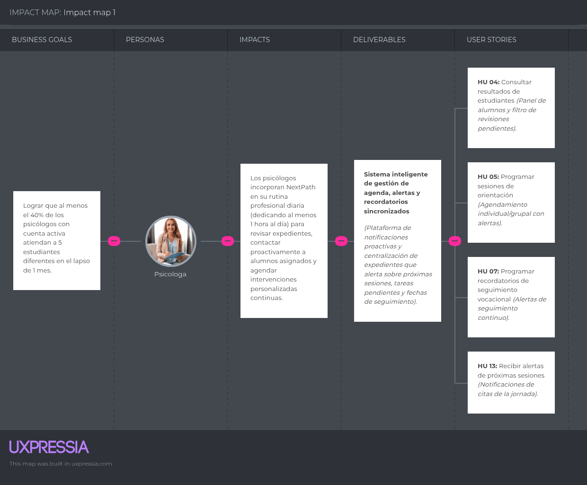

## 3.3. Product Backlog

| N° | Story ID | Épica | Título | Descripción | Story Points |
|:---:|:---:|:---:|---|---|:---:|
| 1 | US01 | E-01 – Evaluación Vocacional | Realizar test vocacional | COMO estudiante QUIERO realizar un test vocacional dentro de la plataforma PARA crear un perfil de intereses y aptitudes con recomendaciones personalizadas. | 5 |
| 2 | US02 | E-01 – Evaluación Vocacional | Visualizar resultados vocacionales | COMO estudiante QUIERO acceder a los resultados detallados de mis tests vocacionales PARA comprender mis áreas de fortaleza, afinidades e iniciar mi exploración profesional. | 3 |
| 3 | US03 | E-01 – Evaluación Vocacional | Realizar test de seguimiento y medir evolución vocacional | COMO estudiante QUIERO realizar tests de seguimiento periódicos PARA medir mi evolución vocacional y ajustar mis decisiones profesionales según mi desarrollo. | 5 |
| 4 | US04 | E-02 – Acompañamiento Psicopedagógico | Consultar resultados de estudiantes | COMO psicólogo QUIERO acceder a los resultados vocacionales de mis estudiantes asignados PARA orientarles según sus intereses, habilidades y aptitudes. | 3 |
| 5 | US05 | E-02 – Acompañamiento Psicopedagógico | Programar sesiones de orientación | COMO psicólogo QUIERO agendar sesiones de orientación individual o grupal con los estudiantes PARA brindar acompañamiento personalizado según los resultados del test. | 5 |
| 6 | US06 | E-02 – Acompañamiento Psicopedagógico | Enviar recomendaciones personalizadas | COMO psicólogo QUIERO enviar observaciones y recomendaciones vocacionales a cada estudiante PARA apoyar su proceso de toma de decisiones profesionales. | 3 |
| 7 | US07 | E-02 – Acompañamiento Psicopedagógico | Programar recordatorios de seguimiento vocacional | COMO psicólogo QUIERO programar recordatorios automáticos de seguimiento PARA asegurar el acompañamiento continuo de los estudiantes en su proceso de elección. | 3 |
| 8 | US08 | E-02 – Acompañamiento Psicopedagógico | Generar reportes estadísticos de orientación vocacional | COMO psicólogo QUIERO generar reportes estadísticos sobre los resultados de los estudiantes PARA identificar patrones grupales y adaptar las estrategias de orientación. | 5 |
| 9 | US09 | E-03 – Recursos y Orientación Grupal | Acceder a recursos vocacionales actualizados | COMO psicólogo QUIERO acceder a una biblioteca de recursos vocacionales actualizados PARA apoyar a mis estudiantes con material informativo de calidad. | 2 |
| 10 | US10 | E-03 – Recursos y Orientación Grupal | Obtener reportes de orientación por grupo de estudiantes | COMO psicólogo QUIERO recibir reportes vocacionales grupales por rango de fecha PARA analizar tendencias del alumnado y planificar intervenciones. | 5 |
| 11 | US11 | E-03 – Recursos y Orientación Grupal | Recomendar actividades personalizadas | COMO psicólogo QUIERO sugerir actividades específicas según el perfil vocacional del estudiante PARA reforzar sus áreas de mayor afinidad. | 3 |
| 12 | US12 | E-04 – Evaluación y Seguimiento Clínico | Evaluar el progreso vocacional del estudiante | COMO psicólogo QUIERO evaluar el progreso del estudiante basándome en sus resultados históricos PARA orientarlo adecuadamente en futuras sesiones. | 3 |
| 13 | US13 | E-04 – Evaluación y Seguimiento Clínico | Recibir alertas de próximas sesiones | COMO psicólogo QUIERO recibir notificaciones de mis próximas sesiones programadas PARA organizar eficientemente mi agenda de atención. | 2 |
| 14 | US14 | E-04 – Evaluación y Seguimiento Clínico | Generar reportes psicológicos automáticos | COMO psicólogo QUIERO generar reportes automáticos sobre los perfiles de los estudiantes PARA facilitar la evaluación profesional y el archivo clínico. | 5 |
| 15 | US15 | E-05 – Exploración y Planificación de Carreras | Búsqueda con filtros inteligentes | COMO estudiante QUIERO filtrar carreras por área, duración y modalidad PARA identificar opciones alineadas a mis preferencias. | 3 |
| 16 | US16 | E-05 – Exploración y Planificación de Carreras | Visualizar ficha detallada de carrera | COMO estudiante QUIERO acceder a la ficha completa de cada carrera PARA conocer su malla curricular, campo laboral y empleabilidad. | 2 |
| 17 | US17 | E-05 – Exploración y Planificación de Carreras | Mostrar compatibilidad vocacional | COMO estudiante QUIERO ver el porcentaje de compatibilidad entre mi perfil vocacional y cada carrera PARA priorizar mis opciones. | 3 |
| 18 | US18 | E-05 – Exploración y Planificación de Carreras | Comparar carreras seleccionadas | COMO estudiante QUIERO comparar carreras seleccionadas en una tabla PARA evaluar diferencias clave en duración, costos y empleabilidad. | 3 |
| 19 | US19 | E-05 – Exploración y Planificación de Carreras | Guardar carreras favoritas | COMO estudiante QUIERO guardar carreras en mi lista de favoritas PARA revisarlas posteriormente en mi panel. | 2 |
| 20 | US20 | E-05 – Exploración y Planificación de Carreras | Simular futuro profesional según perfil vocacional | COMO estudiante QUIERO acceder a una simulación de mi futuro profesional mediante un botón en el panel de la carrera PARA visualizar mi desarrollo y proyección laboral en correlación con mi perfil vocacional. | 8 |
| 21 | US21 | E-06 – Gestión de Progreso y Metas | Visualizar dashboard de progreso | COMO estudiante QUIERO visualizar un panel con mi progreso vocacional y próximos pasos PARA tener claridad sobre mi avance en la plataforma. | 3 |
| 22 | US22 | E-06 – Gestión de Progreso y Metas | Generar plan vocacional personalizado | COMO estudiante QUIERO generar un plan con tareas y fechas basadas en mis resultados e intereses PARA seguir una ruta organizada. | 5 |
| 23 | US23 | E-06 – Gestión de Progreso y Metas | Recibir recordatorios automáticos | COMO estudiante QUIERO recibir recordatorios automáticos sobre mis tareas vocacionales PARA cumplir mis plazos establecidos. | 2 |
| 24 | US24 | E-06 – Gestión de Progreso y Metas | Revisar historial de logros | COMO estudiante QUIERO revisar mi historial de logros y hitos completados PARA reconocer mi avance personal en la orientación. | 2 |
| 25 | US25 | E-07 – Comunicación y Asesoría en Vivo | Chat en tiempo real con psicólogo | COMO estudiante QUIERO iniciar un chat en tiempo real con un psicólogo PARA resolver dudas inmediatas sobre mis resultados vocacionales. | 8 |
| 26 | US26 | E-07 – Comunicación y Asesoría en Vivo | Feedback inmediato sobre resultados del test | COMO estudiante QUIERO recibir retroalimentación automática al terminar mi test PARA comprender mis fortalezas y solicitar asesoría profesional. | 3 |
| 27 | US27 | E-07 – Comunicación y Asesoría en Vivo | Comunicación entre psicólogo y estudiante | COMO psicólogo QUIERO enviar observaciones y retroalimentación directa al estudiante PARA apoyarle en su proceso de elección de carrera. | 3 |
| 28 | US28 | E-07 – Comunicación y Asesoría en Vivo | Retroalimentación en sesiones grupales | COMO psicólogo QUIERO organizar sesiones de feedback grupal en la app PARA orientar a varios estudiantes simultáneamente. | 5 |
| 29 | US29 | E-07 – Comunicación y Asesoría en Vivo | Alertas de actualización de perfil | COMO estudiante QUIERO recibir notificaciones cuando un psicólogo actualice mi perfil PARA estar al tanto de mis progresos. | 2 |
| 30 | US30 | E-08 – Analítica Avanzada y Tendencias | Reporte de evolución del estudiante | COMO psicólogo QUIERO generar un reporte de evolución individual PARA evaluar el progreso vocacional del estudiante a lo largo del tiempo. | 5 |
| 31 | US31 | E-08 – Analítica Avanzada y Tendencias | Panel analítico para psicólogos | COMO psicólogo QUIERO visualizar un panel analítico de mis alumnos asignados PARA identificar patrones de intereses y necesidades de orientación. | 5 |
| 32 | US32 | E-08 – Analítica Avanzada y Tendencias | Comparación de resultados entre grupos | COMO psicólogo QUIERO comparar resultados vocacionales entre grupos de estudiantes PARA identificar diferencias y necesidades específicas por grupo. | 5 |
| 33 | US33 | E-09 – Comunidad Estudiantil y Redes | Unirse a comunidades por intereses | COMO estudiante QUIERO unirme a comunidades temáticas por áreas vocacionales PARA compartir experiencias y aprender con otros estudiantes afines. | 3 |
| 34 | US34 | E-09 – Comunidad Estudiantil y Redes | Publicar y comentar en comunidades | COMO estudiante QUIERO publicar preguntas y comentar en comunidades PARA participar activamente con mis pares. | 5 |
| 35 | US35 | E-09 – Comunidad Estudiantil y Redes | Reaccionar y reportar publicaciones | COMO estudiante QUIERO reaccionar o reportar publicaciones PARA expresar apoyo o mantener un ambiente seguro e informativo. | 3 |
| 36 | US36 | E-09 – Comunidad Estudiantil y Redes | Mensajería privada entre estudiantes | COMO estudiante QUIERO enviar mensajes privados a otros usuarios estudiantiles PARA conversar directamente sobre experiencias universitarias o de carreras. | 5 |
| 37 | US37 | E-09 – Comunidad Estudiantil y Redes | Descubrir hilos recomendados | COMO estudiante QUIERO descubrir hilos de conversación recomendados PARA participar en temas relevantes para mi perfil vocacional. | 5 |
| 38 | US38 | E-10 – Monitoreo e Intervención Temprana | Visualizar tablero de alumnos | COMO psicólogo QUIERO ver un tablero con mis alumnos y su avance vocacional PARA identificar tempranamente quién necesita apoyo. | 5 |
| 39 | US39 | E-10 – Monitoreo e Intervención Temprana | Aplicar filtros de riesgo y participación | COMO psicólogo QUIERO aplicar filtros de riesgo o baja participación PARA priorizar mi acompañamiento en los casos más críticos. | 3 |
| 40 | US40 | E-10 – Monitoreo e Intervención Temprana | Registrar observaciones e intervenciones | COMO psicólogo QUIERO registrar observaciones e intervenciones en la ficha del alumno PARA dar seguimiento a sus avances y acuerdos. | 3 |
| 41 | US41 | E-10 – Monitoreo e Intervención Temprana | Recibir recomendaciones de acción | COMO psicólogo QUIERO recibir sugerencias automáticas de intervención PARA actuar oportunamente ante bajas de participación o alertas de indecisión. | 5 |

# Capítulo IV: Product Design

## 4.1. Style Guidelines

El presente documento forma parte del proyecto Next Path, una plataforma diseñada para acompañar a estudiantes en la toma de decisiones académicas y vocacionales de manera confiable y clara. Nuestro objetivo es brindar una experiencia consistente en todos los puntos de contacto, tanto en web como en dispositivos móviles, reforzando los valores de innovación, orden y confianza que definen el proyecto.

Este documento actúa como una guía de diseño integral que permite a diseñadores, desarrolladores y colaboradores trabajar con una referencia única. Así, aseguramos coherencia visual, comunicación alineada y experiencias unificadas para el usuario.

### 4.1.1. General Style Guidelines

**Branding**

El branding de Next Path busca reflejar innovación, cercanía y orientación confiable. El logotipo representa un ícono de ubicación con flecha ascendente, simbolizando progreso y dirección. 

La mascota “Panda” complementa el tono empático y amigable, reforzando la conexión emocional con el público joven. Todos los elementos deben ser consistentes en escala, color y proporción en cualquier soporte.


---

**Color**

La paleta principal transmite equilibrio, profesionalismo y confianza. Se prioriza el verde petróleo como color central, acompañado de tonos neutros que refuerzan la legibilidad y limpieza visual.

| Uso | Color | Código HEX |
|---|---|:---:|
| **Primario** | Verde petróleo | `#10817F` |
| **Secundario (hover)** | Verde petróleo oscuro | `#004D40` |
| **Texto principal** | Gris oscuro | `#4F4F4F` |
| **Texto claro** | Blanco | `#FFFFFF` |
| **Fondo** | Gris claro | `#F5F5F5` |
| **Botones CTA** | Verde petróleo + blanco | `#10817F` + `#FFFFFF` |

---

**Tipografía**

Se adopta **Montserrat** como tipografía principal por su legibilidad, modernidad y neutralidad visual.

* **Principio:** Uso de espaciado amplio y altura de línea de 1.5, priorizando la lectura en pantallas.

---

**Espaciado y composición**

El diseño sigue un sistema de cuadrícula uniforme (**8px Grid System**). Se mantiene un espaciado generoso entre componentes para evitar sobrecarga visual, garantizando claridad, equilibrio y jerarquía visual.

---

**Tono y lenguaje**

El tono comunicacional es casual, respetuoso y motivador, equilibrando seriedad y entusiasmo. Evita tecnicismos innecesarios y promueve mensajes positivos que transmiten acompañamiento y empatía hacia el estudiante.

### 4.1.2. Web Style Guidelines

**Objetivo**

Definir la experiencia visual e interactiva para usuarios que acceden a Next Path desde navegadores web, manteniendo consistencia en pantallas de escritorio y adaptabilidad en resoluciones responsivas.

---

**Assets**

* **Logo principal:** Ícono de ubicación con flecha ascendente (colores: `#10817F` o blanco sobre fondo oscuro).
* **Mascota:** Panda vectorial estilo flat, usado en secciones de ayuda y mensajes motivacionales.
* **Íconos:** Estilo lineal, con trazos finos y consistentes.
* **Imágenes de apoyo:** Mockups de la aplicación en contextos educativos, acompañados de frases inspiradoras.

---

**Component Library**

* **Botones primarios:** Relleno verde petróleo (`#10817F`), texto blanco, bordes redondeados (radius `8px`).
* **Botones secundarios:** Fondo gris claro (`#F5F5F5`), texto verde petróleo (`#10817F`).
* **Navbar:** Fija superior, fondo blanco, opción "Comenzar ahora" resaltada con fondo verde-azulado.
* **Cards:** Fondo blanco, esquinas redondeadas (radius `12px`), sombra leve.
* **Inputs:** Borde gris claro (`#E0E0E0`), placeholder gris suave, esquinas redondeadas.
* **CTA (Call To Action):** Bloques hero con fondo verde petróleo y tipografía blanca.

---

**Layout y Espaciado**

* Márgenes laterales amplios (mínimo `24px`).
* Contenido centrado y jerarquizado en tres niveles: encabezado, cuerpo y llamada a la acción.
* Consistencia en botones, paddings y sombras para reforzar la estructura visual.

---

**Interacción y Feedback**

* **Hover:** Aclarado de fondo y leve aumento de sombra.
* **Focus:** Borde visible (`#004D40`) para accesibilidad.
* **Transiciones:** Suaves (`0.2s`–`0.3s`) en botones e íconos.


## 4.2. Information Architecture

### 4.2.1. Organization Systems
El sistema de organización de Next Path combina tres modelos principales: jerárquico, secuencial y matricial, que se aplican según el tipo de contenido y el flujo de interacción.

**Estructuras de organización:**

* **Jerárquica:**
  En la Landing Page, el contenido se estructura de manera jerárquica comenzando por la sección de Inicio, seguida por *Sobre Nosotros*, *Cómo Funciona*, *Comenzar Ahora* y *Contáctanos*. Esta disposición guía al visitante desde la comprensión general del producto hasta la acción final de registro o descarga, utilizando bloques visuales claros, íconos explicativos y llamados a la acción progresivos.

* **Secuencial (Step-by-step):**
  En la aplicación, la experiencia del estudiante sigue un flujo paso a paso alineado a su objetivo principal: descubrir su perfil vocacional. El recorrido se compone de las siguientes etapas:
  1. Inicio de sesión o registro.
  2. Pantalla de bienvenida.
  3. Ejecución del test vocacional.
  4. Resultados y reporte.
  5. Recomendaciones de carrera.
  6. Opciones de asesoría o descarga del reporte.
  
  Este orden lógico minimiza la carga cognitiva y mantiene la motivación del usuario durante el proceso.

* **Matricial:**
  Se aplica en módulos donde existen múltiples criterios de navegación cruzada, tales como la *Exploración de Carreras* o la *Gestión de Estudiantes*:
  * **Estudiantes:** Pueden ordenar y filtrar las carreras sugeridas por afinidad, demanda laboral o universidad.
  * **Psicólogos:** Pueden visualizar por estado de asesoría (*pendiente*, *en curso*, *completado*) o tipo de evaluación.

---

**Sistemas de categorización utilizados:**

* **Por audiencia:** Diferenciación de contenidos, funcionalidades y vistas según el rol del usuario (*estudiante* o *psicólogo*).
* **Por tópicos:** Clasificación temática en áreas clave: orientación vocacional, asesorías, reportes, simulaciones y recursos.
* **Cronológica:** Registro temporal aplicado directamente en los módulos de *Historial de Asesorías* y *Reportes Recientes*.

### 4.2.2. Labeling Systems

El sistema de etiquetado busca mantener consistencia entre plataformas y asegurar una comprensión rápida. Las etiquetas son cortas, descriptivas y acompañadas por íconos visualmente coherentes con las Style Guidelines.

| Etiqueta | Descripción |
|---|---|
| **Inicio** | Pantalla principal donde el usuario visualiza el resumen o menú inicial de navegación. |
| **Iniciar Test** | Botón principal para comenzar el test vocacional del estudiante. |
| **Resultados** | Sección que muestra los gráficos y descripciones del perfil vocacional obtenido. |
| **Carreras Recomendadas** | Módulo donde el estudiante explora las opciones sugeridas según su perfil Holland. |
| **Simulaciones** | Espacio interactivo que muestra trayectorias académicas y laborales según los resultados. |
| **Asesorías** | Zona de gestión de sesiones entre estudiantes y psicólogos. |
| **Reportes Recientes** | Módulo donde se listan los resultados y análisis generados más recientemente. |
| **Perfil** | Sección de configuración y personalización del usuario (datos, intereses, foto, etc.). |
| **Configuración** | Ajustes técnicos de cuenta y preferencias generales del usuario. |
| **Reportes (Psicólogo)** | Pantalla que centraliza los informes vocacionales o de progreso. |
| **Evaluaciones (Psicólogo)** | Sección donde el psicólogo revisa y genera resultados de los tests aplicados. |
| **Seguimiento (Psicólogo)** | Módulo donde se registran las observaciones y evolución de cada estudiante. |
| **Botones de acción comunes** | *Iniciar Test, Ver Resultados, Explorar Carreras, Agendar Asesoría, Descargar Reporte, Ver Perfil, Guardar Cambios, Cerrar Sesión.* Estas etiquetas de acción facilitan la comprensión y el flujo guiado. |

### 4.2.3. SEO Tags and Meta Tags

* **Título:**
  ```html
  <title>Tu Perfil Vocacional | NextPath</title>
  ```

* **Codificación de caracteres:**
  ```html
  <meta charset="utf-8">
  ```

* **Descripción:**
  ```html
  <meta name="description" content="Accede a tus resultados vocacionales, explora carreras compatibles, comunícate con tu psicólogo y simula tu trayectoria en base al mercado laboral actual.">
  ```

* **Palabras Claves:**
  ```html
  <meta name="keywords" content="perfil vocacional, resultados de test, simulación de trayectoria, mercado laboral, asesoría psicológica, seguimiento vocacional">
  ```

* **Autor y Derechos de Autor:**
  ```html
  <meta name="author" content="NextPath Team">
  <meta name="copyright" content="Copyright 2026 VocaFy Team">
  ```

### 4.2.4. Searching Systems

El sistema de búsqueda en Next Path tiene como propósito reducir el tiempo que toma localizar información relevante, utilizando filtros personalizados según el rol del usuario.

**Componentes principales:**

* **Buscador general:** Presente en la parte superior de la interfaz principal de las aplicaciones, permite buscar carreras, estudiantes o reportes:
  * **Estudiante:** Puede buscar por carrera, universidad o nivel de afinidad.
  * **Psicólogo:** Puede buscar asesorías o reportes por nombre o fecha de sesión.

* **Filtros específicos:** Cada búsqueda incluye filtros dinámicos adaptados al perfil:
  * **Estudiantes:** Área de conocimiento, nivel de empleabilidad o universidad.
  * **Psicólogos:** Tipo de test, estado del reporte y nivel de progreso.

* **Búsqueda predictiva:** El motor de búsqueda incluye sugerencias automáticas basadas en el historial del usuario y en perfiles similares, optimizando el acceso a información relevante.

| Etiqueta | Descripción |
|---|---|
| **Filtro por nivel de empleabilidad (Estudiante)** | Clasifica las carreras recomendadas según su demanda laboral o proyección profesional. |
| **Filtro por universidad (Estudiante)** | Permite visualizar las instituciones donde se ofrece una carrera específica. |
| **Filtro por afinidad personal (Estudiante)** | Ordena los resultados según la coincidencia con el perfil Holland del usuario. |
| **Filtro por estado de asesoría (Psicólogo)** | Clasifica las sesiones según su estado: *pendiente, en curso, completada*. |
| **Filtro por fecha (Psicólogo)** | Permite visualizar evaluaciones o asesorías según su fecha de realización. |
| **Filtro predictivo (Todos los roles)** | Motor inteligente que sugiere resultados automático

### 4.2.5. Navigation Systems

El sistema de navegación de NextPath está diseñado para guiar al usuario de forma clara y coherente a través de la Landing Page y la aplicación. Se busca que todas las interacciones sean predecibles, rápidas y consistentes con el objetivo de cada rol.

**Tipos de navegación implementados:**

* **Navegación global:**
  En la Landing Page, el Header incluye accesos directos principales a *Inicio*, *Sobre Nosotros*, *Cómo Funciona*, *Comenzar Ahora* y *Contáctanos*.

* **Navegación local:**
  Dentro de cada módulo se encuentran subniveles específicos según el contexto de uso:
  * **Módulo Reportes Vocacionales (Psicólogo):** Opciones para consultar historiales, abrir evaluaciones existentes o generar nuevos informes analíticos.

* **Navegación secuencial:**
  Se implementa mediante migas de pan (*breadcrumbs*) y flujos paso a paso para mantener claridad sobre la ubicación del usuario dentro de la jerarquía.

* **Navegación adaptada por rol:**
  * **Estudiante:** Experiencia centrada en el flujo de realización del test vocacional, exploración de carreras afines y seguimiento de su plan vocacional.
  * **Psicólogo:** Panel especializado enfocado en la gestión de sesiones clínicas, registro de notas u observaciones profesionales y análisis del progreso longitudinal.

## 4.3. Landing Page UI Design

En esta sección se presenta la propuesta de diseño de la interfaz de usuario para la Landing Page de NextPath. El objetivo es reflejar de manera visual las decisiones tomadas durante la fase de arquitectura de información, garantizando una experiencia clara, atractiva y coherente con la identidad de marca.

### 4.3.1. Landing Page Wireframe

**Desktop Web browser:**

* **Inicio:**
  Presenta el hero banner con la frase “Conviértete en un profesional” y el CTA “Comenzar”. El fondo con imagen de aula refuerza el contexto educativo. Los principios aplicados son el de jerarquía visual y contraste.

  

* **Sobre nosotros:**
  Integra texto informativo con el personaje panda como elemento visual que genera empatía. Los principios aplicados son el de consistencia visual y relación con el mundo real.

  

* **¿Cómo funciona?:**
  Se divide en tres tarjetas explicativas: *Descúbrete*, *Conecta*, *Traza tu plan*, cada una con ícono y texto breve. El principio aplicado es el de relación con el mundo real.

  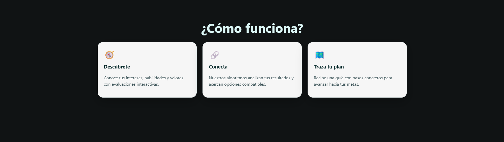

* **Descargar (Comenzar ahora):**
  Presenta botones de descarga y reitera el valor de la app, acompañada del panda. Los principios aplicados son minimalismo, accesibilidad y claridad.

  

* **Contáctanos:**
  Sección inferior con accesos a redes sociales.

  

### 4.3.2. Landing Page Mock-up


## 4.4. Web Applications UX/UI Design
Esta sección incluye secciones internas donde se presenta y explica la propuesta visual y de interacción para las aplicaciones que constituyen la experiencia de usuario con los productos digitales.
### 4.4.1. Web Applications Wireframes
####  <p align="center"> Vista de estudiante</p>
<b> wireframe 1:</b> Inicio de sesion 
<br>

<b> wireframe 2: </b>Diseño de Menu dashboard estudiante <br>
<br>

<b> wireframe 3:</b> Diseño de Menu elecion de test vocacionales <br>
<br>

<b> wireframe 4:</b> Diseño desarrollo de test <br>
<br>

<b> wireframe 5:</b> Diseño de Menu Comunidad <br>
<br>

<b> wireframe 6</b> Diseño Menu Carreras a elecion <br>
<br>

<b> wireframe 7:</b> Menu Favoritos <br>
<br>

<b> wireframe 8:</b> Diseño de Menu tareas  <br>
<br>

<b> wireframe 9:</b> Diseño de Sesiones en vivo Estudiante <br>
<br>

<b> wireframe 9:</b> Diseño de Menu Mensaje directo con psicologo<br>
<br>

####  <p align="center"> Vista de Psicologo</p>

<b> wireframe 10: Diseño de Menu Dashboard psicologo </b><br>
<br>

<b> wireframe 11: Diseño de Menu monitoreo estudiante </b><br>
<br>

<b> wireframe 12: Diseño de Menu Comparativa de grupos </b><br>
<br>

<b> wireframe 13: Diseño de Menu Programacion de sesion en vivo </b><br>
<br>

<b> wireframe 14: Diseño de Menu Mensaje directo con estudiante </b><br>
<br>

<b> wireframe 15: Diseño de Menu material vocacional </b><br>
<br>


### 4.4.2. Web Applications Wireflow Diagrams
1) <b> Wireflow 1:</b>  Como usuario,quiero Registrarme en la plataforma
<br>

2)  <b> Wireflow 2:</b>  Como Estudiante, quiero Realizar un Test Vocacional con IA y Obtener Resultados
<br>

3)  <b> Wireflow 3:</b> Como estudiante ,quiero Tener acceso a la simulacion de futuro profeciona
<br>

4)  <b> Wireflow 4:</b>  Como estudiante ,quiero Tener acceso a la comparacion de carreras
<br>

5)  <b> Wireflow 5:</b>  Como estudiante ,quiero agregar carreras a mis favoritos
<br>

6)  <b> Wireflow 6:</b> Como estudiante ,quiero visualizar mis tareas y recomendaciones
<br>

7)  <b> Wireflow 7:</b>  Como estudiante ,quiero unirme a una sesion en vivo con mi psicologo
<br>

8)  <b> Wireflow 8:</b> Como estudiante quiero comunicarme directamente con mi psicologo
<br>

9)  <b> Wireflow 9:</b>  Como estudiante,quiero accedera  la comunidad
<br>

10)  <b> Wireflow 10:</b> Como psicologo quiero monitorear el desempeño de un estudiante
<br>

11) <b> Wireflow 11:</b> Como psicologo,quiero acceder a una comparativa grupal de los estudiantes
<br>

12)  <b> Wireflow 12:</b> Como psicólogo quiero agendar sesiones con mis estudiantes
<br>

13)  <b> Wireflow 13:</b> Como psicologo,quiero compartir material vocacional con los estudiantes
<br>

14)  <b> Wireflow 14:</b> Como psicologo ,quiero comunicarme directamente con los estudiante
<br>

### 4.4.3. Web Applications Mock-ups

####  <p align="center"> Vista de estudiante</p>
<b> Mock-up 1:</b> Inicio de sesion 
<br>

<b> Mock-up 2: </b>Diseño de Menu dashboard estudiante <br>
<br>

<b> Mock-up 3:</b> Diseño de Menu elecion de test vocacionales <br>
<br>

<b> Mock-up 4:</b> Diseño desarrollo de test <br>
<br>

<b> Mock-up 5:</b> Diseño de Menu Comunidad <br>
<br>

<b> Mock-up 6</b> Diseño Menu Comparativa de Carreras <br>
<br>

<b> Mock-up 7</b> Diseño Menu Carrera y simulacion <br>
<br>

<b> Mock-up 8:</b> Menu Favoritos <br>
<br>

<b> Mock-up 9:</b> Diseño de Menu tareas  <br>
<br>

<b> Mock-up 10</b> Diseño de Sesiones en vivo Estudiante <br>
<br>

**<b> Mock-up 11:</b>** Diseño de Menu Mensaje directo con psicologo<br>
<br>

####  <p align="center"> Vista de Psicologo</p>

<b> Mock-up 12: Diseño de Menu Dashboard psicologo </b><br>
<br>

<b> Mock-up 13: Diseño de Menu monitoreo estudiante </b><br>
<br>

<b> wireframe 14: Diseño de Menu Comparativa de grupos </b><br>
<br>

<b> Mock-up 15: Diseño de Menu Programacion de sesion en vivo </b><br>
<br>

<b> Mock-up 16: Diseño de Menu Mensaje directo con estudiante </b><br>
<br>

<b> Mock-up 17: Diseño de Menu material vocacional </b><br>
<br>
### 4.4.4. Web Applications User Flow Diagrams
1) **User flow 1:**
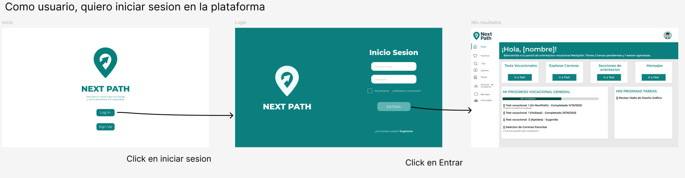<br>
2) **User flow 2:**
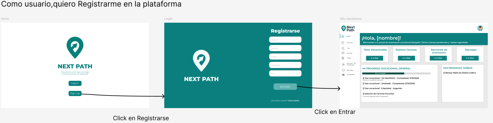<br>
3) **User flow 3:**
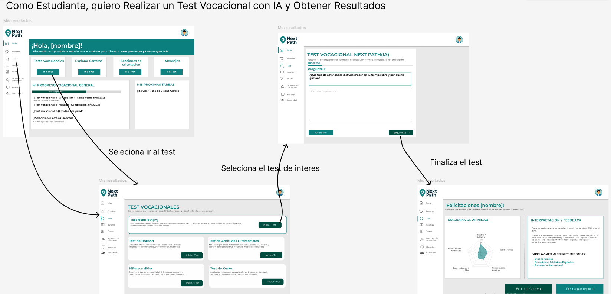<br>
4) **User flow 4:**
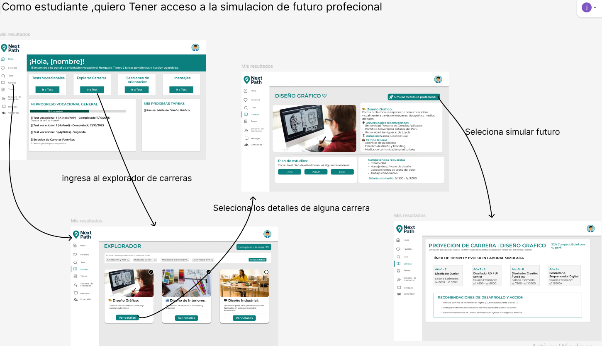<br>
5) **User flow 5:**
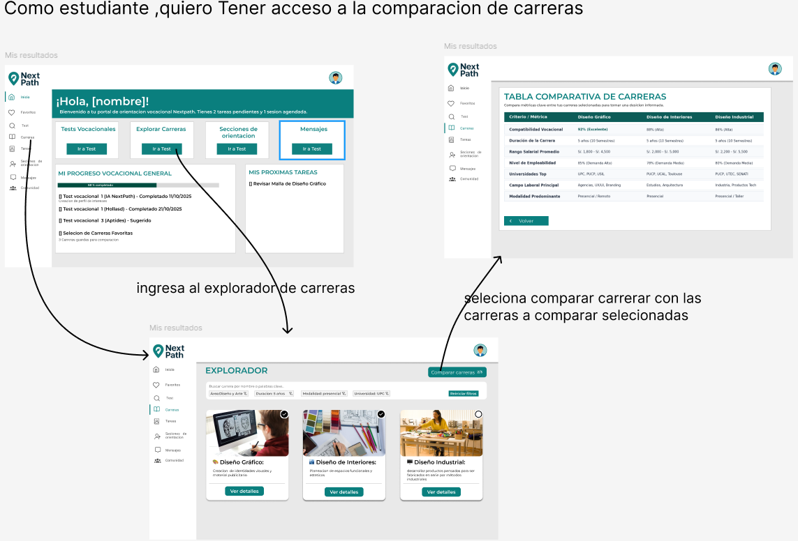<br>
6) **User flow 6:**
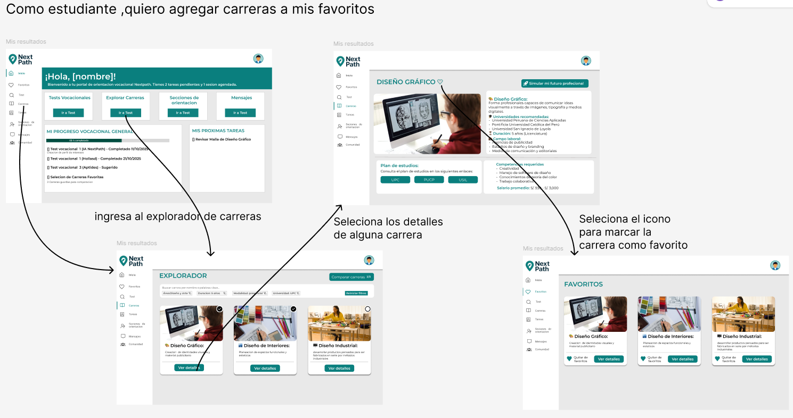<br>
7) **User flow 7:**
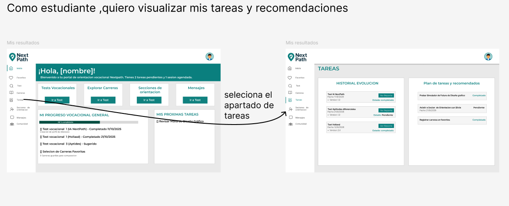<br>
8) **User flow 8:**
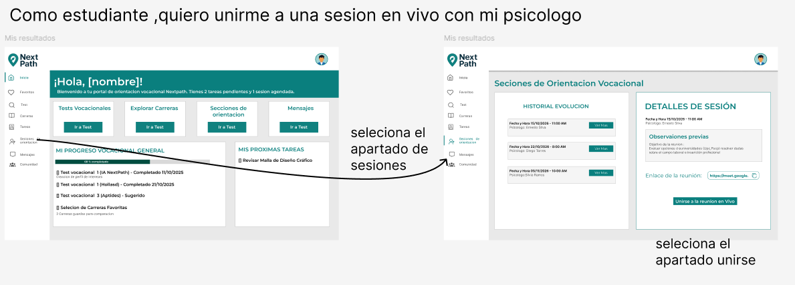<br>
9) **User flow 9:**
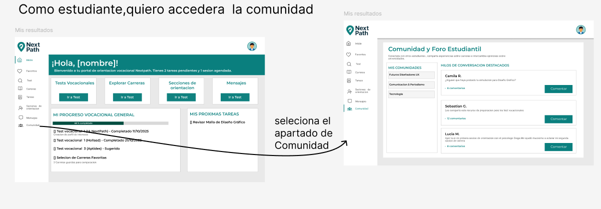<br>
10) **User flow 10:**
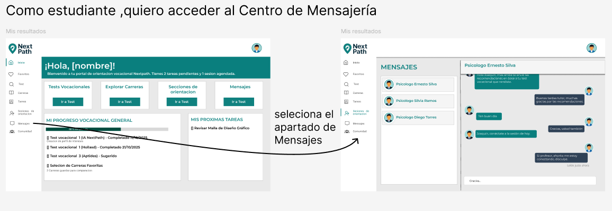<br>
11) **User flow 11:**
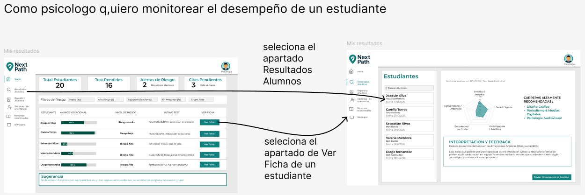<br>
12) **User flow 12:**
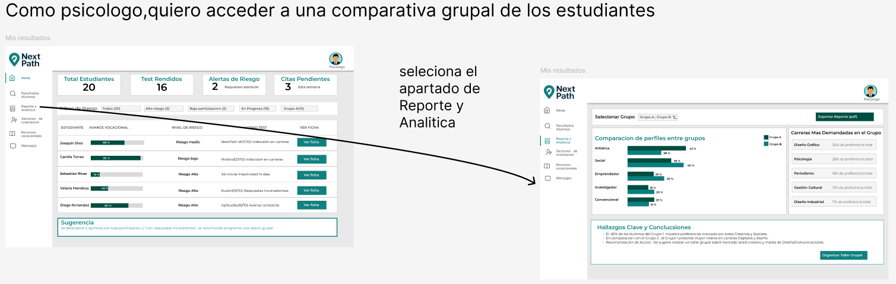<br>
13) **User flow 13:**
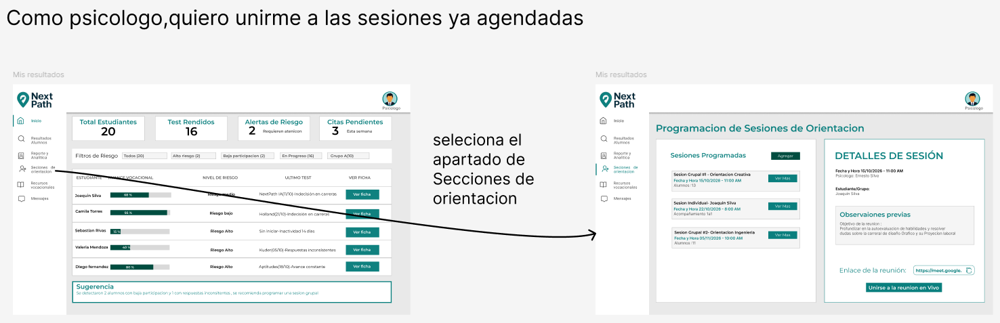<br>
14) **User flow 14:**
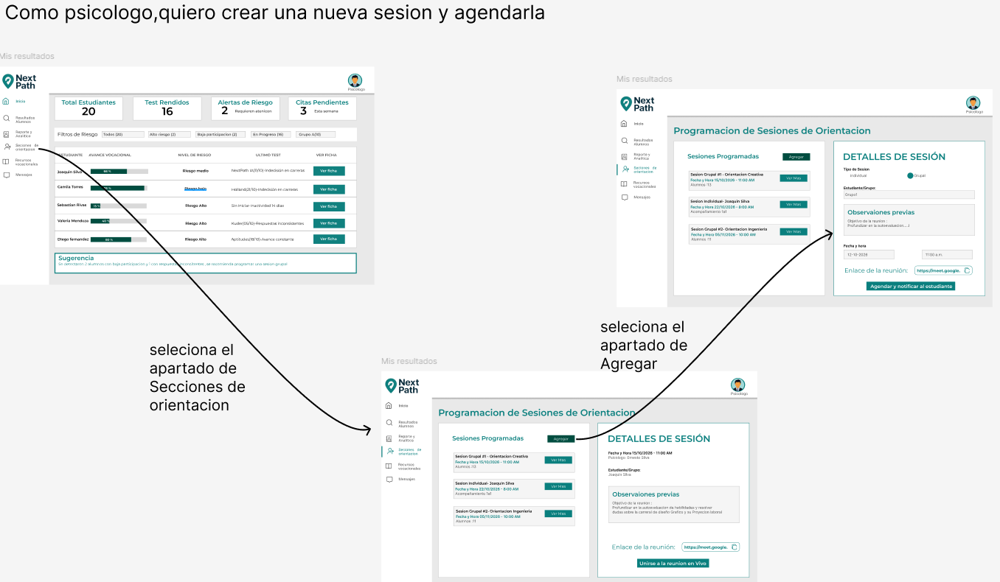<br>
15) **User flow 15:**
<br>
 

## 4.5. Web Applications Prototyping
Se realizo en figma el siguiente prototipo:[enlace a el prototipo](https://www.figma.com/proto/94GGZMAWgMbWul2n6ebtfV/aplicaciones-web?node-id=32-2585&t=3DqncPLoa0s4RjPg-1&scaling=min-zoom&content-scaling=fixed&page-id=0%3A1&starting-point-node-id=32%3A2585)
## 4.6. Domain-Driven Software Architecture

### 4.6.1. Design-Level Event Storming

Para una mejor visualización, se adjunta aquí el [enlace a nuestro tablero de Miro](https://miro.com/welcomeonboard/MEljTU1nWW9FSEhGU2RvcnRPQWJ0VFVxOGlzME9QR2M2a3kxdFRGVWUvUjMzU0RGN21qM3cyWjExV1krQSsvalVoblhxZlplK3BSUU0xV29mTGRtbUY3bEhWV2hMWDN1UjZ1bkVieUYyREtkcnR2eFBCb3dIcFFPRUdMZStsYlBBS2NFMDFkcUNFSnM0d3FEN050ekl3PT0hdjE=?share_link_id=62509929931.) donde fue realizado el Design-Level Event Storming.

<div align="center">
  <br><br>
  <br><br>
  <br><br>
  <br><br>
  <br><br>
  <br><br>
  <br><br>
  <br><br>
  <br><br>
  <br><br>
  <br><br>

</div>

### 4.6.2. Software Architecture Context Diagram
El Context Diagram presenta a VocaFy como el sistema central de la solución, mostrando los principales usuarios y sistemas externos con los que interactúa. Este nivel permite identificar el contexto general del sistema y las principales relaciones que mantiene con su entorno.
<div align="center">
  
</div>

### 4.6.3. Software Architecture Container Diagrams
El Container Diagram representa los principales elementos de alto nivel que conforman la arquitectura de software de VocaFy. En este nivel se muestran los containers, las tecnologías utilizadas y la distribución de responsabilidades, así como las principales interacciones y comunicaciones entre ellos.

<div align="center">
  
</div>

### 4.6.4. Software Architecture Components Diagrams
#### IAM & Auth Service

El Component Diagram de IAM & Auth Service muestra la descomposición del servicio encargado de gestionar la identidad, autenticación y autorización de los usuarios de VocaFy. Sus componentes permiten administrar el acceso de los usuarios y controlar los permisos necesarios para utilizar las funcionalidades de la plataforma.

<div align="center">
  
</div>


#### Assessment Service

El Component Diagram de Assessment Service muestra la descomposición del servicio encargado de gestionar las evaluaciones vocacionales. Sus componentes permiten administrar el ciclo de vida de las evaluaciones, registrar las respuestas de los estudiantes, calcular el perfil vocacional y generar retroalimentación inicial.

<div align="center">
  
</div>


#### Career Planning Service

El Component Diagram de Career Planning Service muestra la descomposición del servicio encargado de apoyar la exploración y planificación de la trayectoria profesional de los estudiantes. Sus componentes permiten gestionar la exploración de carreras, la planificación de objetivos profesionales y el seguimiento de las decisiones relacionadas con el desarrollo profesional.

<div align="center">
  
</div>


#### Billing Service

El Component Diagram de Billing Service representa los componentes encargados de gestionar las suscripciones premium, el procesamiento de pagos y el registro de las transacciones. El servicio mantiene la información relacionada con la facturación y se comunica con el Payment Gateway para procesar los pagos.

<div align="center">
  
</div>


#### Community Service

El Component Diagram de Community Service representa los componentes responsables de gestionar las comunidades, publicaciones, comentarios, reacciones, moderación, mensajería privada y recomendaciones de hilos. Los componentes interactúan entre sí y utilizan la base de datos del servicio para almacenar la información relacionada con las actividades de la comunidad.

<div align="center">
  
</div>


#### Advisory Service

El Component Diagram de Advisory Service muestra los componentes relacionados con la gestión de sesiones de orientación, la vinculación entre estudiantes y psicólogos, la comunicación durante las sesiones, el registro de notas y reportes y el seguimiento de los estudiantes. Estos componentes trabajan conjuntamente para gestionar el proceso de orientación dentro de VocaFy.

<div align="center">
  
</div>


#### Analytics & AI Service

El Component Diagram de Analytics & AI Service representa los componentes encargados de recopilar y procesar datos, realizar análisis, generar recomendaciones mediante capacidades de inteligencia artificial, producir reportes y administrar modelos de machine learning. El servicio utiliza una base de datos para almacenar información analítica y se comunica con la AI API para utilizar capacidades de inteligencia artificial.

<div align="center">
  
</div>


## 4.7. Software Object-Oriented Design

En esta sección se detallan las decisiones de diseño orientado a objetos para la implementación de los componentes de software asociados a cada *Bounded Context* identificado en la solución. Con el objetivo de garantizar una arquitectura de software con bajo acoplamiento, alta cohesión y una clara separación de responsabilidades, la estructura interna de cada contexto se ha modelado bajo el enfoque de **Domain-Driven Design (DDD)** y **Clean Architecture**, organizando los componentes en tres capas tácticas fundamentales:

1. **Capa de Dominio (*Domain Layer*):**
  * **Propósito:** Constituye el núcleo central de la aplicación y encapsula las reglas de negocio puras, independientes de cualquier tecnología, base de datos o marco de trabajo.
  * **Componentes:**
    * **Entidades y Agregados (*Entities & Aggregate Roots*):** Clases concretas y abstractas que representan los conceptos principales del negocio, definiendo sus atributos privados, métodos de comportamiento público e identidades unívocas.
    * **Objetos de Valor y Enumeraciones (*Value Objects & Enums*):** Conjuntos fijos de constantes y tipos strictly definidos que restringen los estados válidos del sistema.
    * **Servicios de Dominio (*Domain Services*):** Encapsulan lógica de negocio que involucra múltiples entidades o reglas transversales que no pertenecen a una única entidad.
    * **Contratos de Repositorio (*Repository Interfaces*):** Interfaces (`IRepository`) que definen las operaciones de persistencia requeridas por el dominio, aplicando el principio de inversión de dependencias.

2. **Capa de Aplicación (*Application Layer*):**
  * **Propósito:** Orquesta la ejecución de los casos de uso y coordina los flujos de trabajo del sistema, actuando como intermediario entre la infraestructura exterior y el dominio [1].
  * **Componentes:**
    * **Servicios de Aplicación (*Application Services*):** Clases que reciben las peticiones de los usuarios o sistemas clientes, invocan los contratos del dominio e interactúan con los servicios externos sin contener lógica de negocio directa.

3. **Capa de Infraestructura (*Infrastructure Layer*):**
  * **Propósito:** Provee el soporte técnico y las implementaciones concretas para la persistencia de datos y la comunicación con servicios externos.
  * **Componentes:**
    * **Implementación de Repositorios (*Repository Implementations & DbContext*):** Clases concretas que implementan las interfaces del dominio para interactuar con la base de datos relacional.
    * **Servicios y APIs Externas (*External APIs & Services*):** Adaptadores de integración para el consumo de servicios de Inteligencia Artificial (generación de perfiles, simulaciones y reportes) y servicios de terceros (pasarelas de pago y envío de notificaciones/correos).

---

### 4.7.1. Class Diagrams

#### 4.7.1.1. User Registration & Profile Context
* **Propósito:** Se encarga de la autenticación, la recuperación de credenciales y la vinculación de estudiantes con sus psicólogos asignados.
* **Capa de Dominio:** Define las enumeraciones `UserRole` y `RegistrationStatus`, la clase abstracta `User` (con clases hijas `Student` y `Psychologist`), la entidad `PsychologistLink`, el objeto de valor `PasswordResetToken` y la interfaz `IUserRepository`.
* **Capa de Aplicación:** `UserApplicationService` orquesta los casos de uso de registro de usuario, autenticación y restablecimiento de contraseña.
* **Capa de Infraestructura:** Implementa `UserRepositoryImpl` para la persistencia en base de datos y se integra con `EmailService` para el envío del enlace de recuperación de contraseña.
<div align="center">
  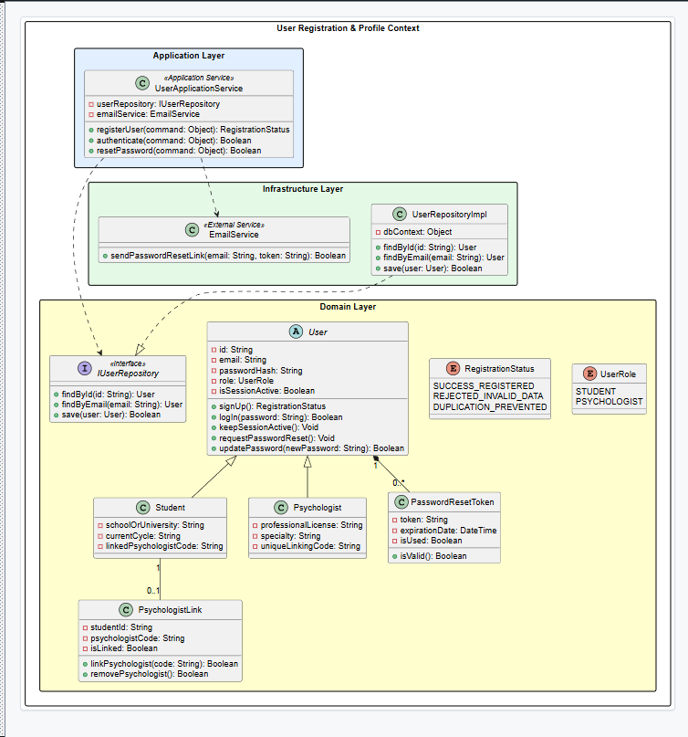<br><br>
</div>

#### 4.7.1.2. Search Context
* **Propósito:** Proporciona los mecanismos de búsqueda de carreras profesionales mediante barra de navegación y filtros parametrizados, además de almacenar el historial de búsquedas del estudiante.
* **Capa de Dominio:** Contiene la entidad `CareerSearch` para gestionar criterios de búsqueda y la interfaz `ICareerSearchRepository`.
* **Capa de Aplicación:** `SearchApplicationService` coordina las peticiones de consulta y aplicación de filtros solicitadas por los usuarios.
* **Capa de Infraestructura:** `CareerSearchRepositoryImpl` realiza la consulta optimizada sobre la base de datos y guarda el historial de búsquedas por usuario.
<div align="center">
  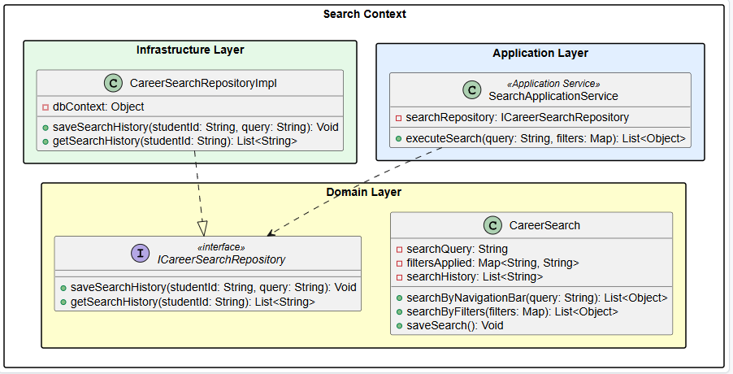<br><br>
</div>

#### 4.7.1.3. Vocational Evaluation Context
* **Propósito:** Gestiona el flujo completo de evaluación vocacional del estudiante, desde el inicio del test hasta el cálculo automatizado del perfil vocacional.
* **Capa de Dominio:** Modela el estado del test con `TestStatus`, las entidades `VocationalTest` y `VocationalProfile`, e independiza la persistencia mediante `IVocationalTestRepository`.
* **Capa de Aplicación:** `EvaluationApplicationService` controla la ejecución del test y coordina el procesamiento de respuestas con la IA.
* **Capa de Infraestructura:** `VocationalTestRepositoryImpl` gestiona la persistencia del test y `AIVocationalService` invoca la API externa de Inteligencia Artificial para generar el perfil y la retroalimentación automática.
<div align="center">
  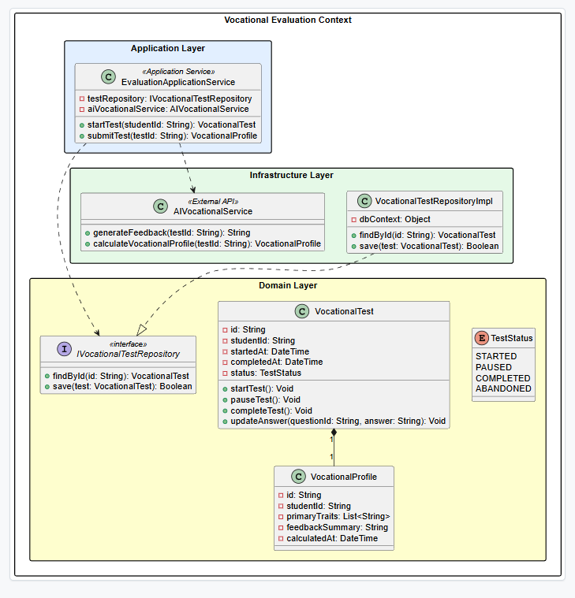<br><br>
</div>

#### 4.7.1.4. Career Exploration & Planning Context
* **Propósito:** Permite la exploración detallada de carreras, la comparación matricial, el cálculo de compatibilidad vocacional y la simulación de planes de carrera personalizados.
* **Capa de Dominio:** Incluye las entidades `Career`, `CareerCompatibility` y `VocationalPlan`, junto con las interfaces `ICareerRepository` e `IVocationalPlanRepository`.
* **Capa de Aplicación:** `CareerPlanningApplicationService` ejecuta los casos de uso para explorar opciones, calcular compatibilidades y ajustar la hoja de ruta estudiantil.
* **Capa de Infraestructura:** `CareerRepositoryImpl` gestiona el catálogo de carreras y `AICareerService` consume la API de IA para realizar simulaciones de trayectoria laboral.
<div align="center">
  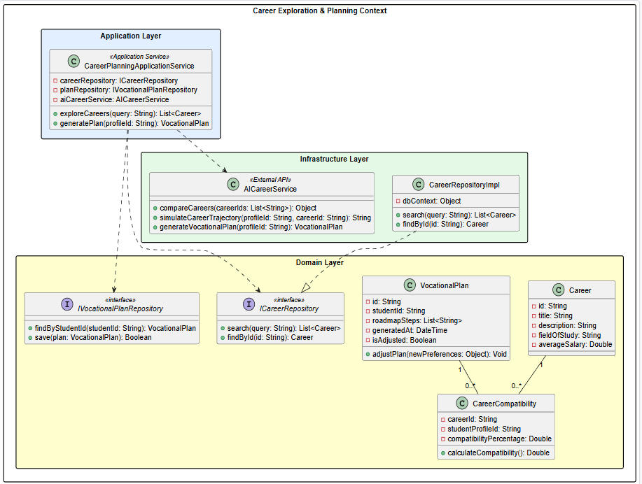<br><br>
</div>

#### 4.7.1.5. Student Monitoring Context
* **Propósito:** Brinda al psicólogo la capacidad de realizar el seguimiento clínico y psicopedagógico del estudiante a través de su historial evaluativo y observaciones profesionales.
* **Capa de Dominio:** Define la entidad `HistoricalProfile` que agrupa el historial del estudiante, las observaciones en `ProfessionalObservation` y la interfaz `IStudentMonitoringRepository`.
* **Capa de Aplicación:** `MonitoringApplicationService` canaliza la visualización de expedientes y el registro de notas u observaciones profesionales.
* **Capa de Infraestructura:** `StudentMonitoringRepositoryImpl` persiste las observaciones y consulta el historial acumulado en la base de datos.
<div align="center">
  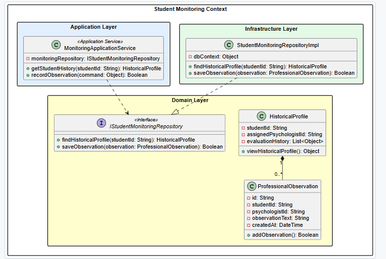<br><br>
</div>

#### 4.7.1.6. Reports Context
* **Propósito:** Encargado de la síntesis y validación de reportes de evolución vocacional individual y comparativas estadísticas a nivel de cohortes o grupos.
* **Capa de Dominio:** Contiene las entidades `VocationalReport` y `GroupComparisonReport`, junto con el contrato `IVocationalReportRepository`.
* **Capa de Aplicación:** `ReportApplicationService` orquesta la generación de reportes y las solicitudes de conclusiones automáticas.
* **Capa de Infraestructura:** `VocationalReportRepositoryImpl` guarda los reportes validados y `AIReportService` se conecta con la API de IA para redactar síntesis y conclusiones grupales.
<div align="center">
  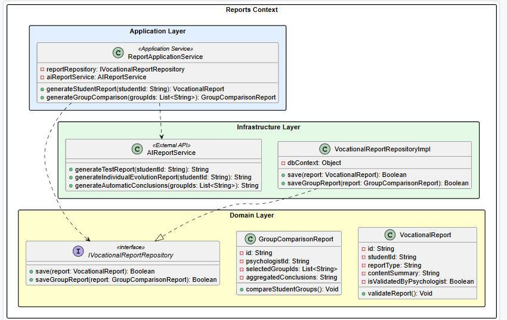<br><br>
</div>

#### 4.7.1.7. Payment & Subscription Context
* **Propósito:** Gestiona el procesamiento de transacciones monetarias y la activación de planes de suscripción Premium en la plataforma.
* **Capa de Dominio:** Modela la cuenta de suscripción en `Subscription`, el historial financiero en `PaymentTransaction` y la interfaz `ISubscriptionRepository`.
* **Capa de Aplicación:** `PaymentApplicationService` gestiona la solicitud de cobro, la validación de respuesta y la activación de beneficios en la cuenta.
* **Capa de Infraestructura:** `SubscriptionRepositoryImpl` actualiza el estado de la cuenta y `PaymentGateway` actúa como conector con la pasarela de pagos externa.
<div align="center">
  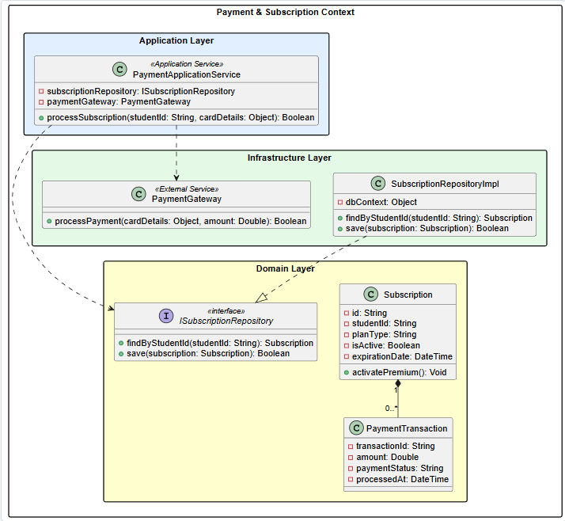<br><br>
</div>

#### 4.7.1.8. Scheduling & Session Context
* **Propósito:** Administra la agenda de citas del psicólogo y la programación de sesiones de orientación individuales y grupales.
* **Capa de Dominio:** Utiliza la enumeración `SessionStatus`, la clase abstracta `Session` especializada en `IndividualSession` y `GroupSession`, y la interfaz `ISessionRepository`.
* **Capa de Aplicación:** `SessionApplicationService` gestiona las reservas, la detección de conflictos de horario y la recomendación de agrupamientos óptimos.
* **Capa de Infraestructura:** `SessionRepositoryImpl` se encarga de registrar y actualizar el estado de las citas en el sistema de almacenamiento.
<div align="center">
  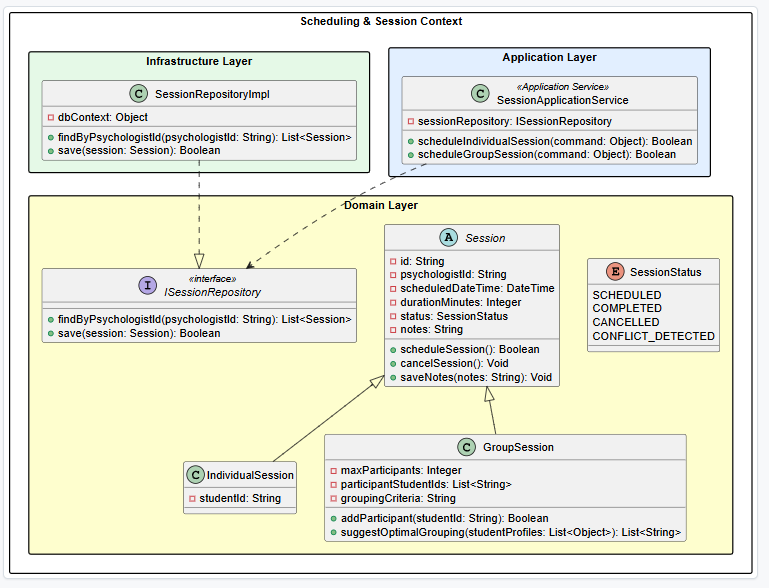<br><br>
</div>

#### 4.7.1.9. Community & Chat Context
* **Propósito:** Soporta la interacción social entre estudiantes mediante foros temáticos y la comunicación privada 1 a 1 entre usuario y psicólogo.
* **Capa de Dominio:** Modela la jerarquía `Community`, `CommunityPost` y `CommunityComment`, junto con la entidad de mensajería `ChatMessage` y sus respectivos contratos de repositorio (`ICommunityRepository`, `IChatRepository`).
* **Capa de Aplicación:** `CommunityApplicationService` y `ChatApplicationService` procesan la publicación de contenidos, moderación y el envío de mensajes privados.
* **Capa de Infraestructura:** `CommunityRepositoryImpl` y `ChatRepositoryImpl` persisten las publicaciones, reacciones y mensajes del chat en tiempo real.
<div align="center">
  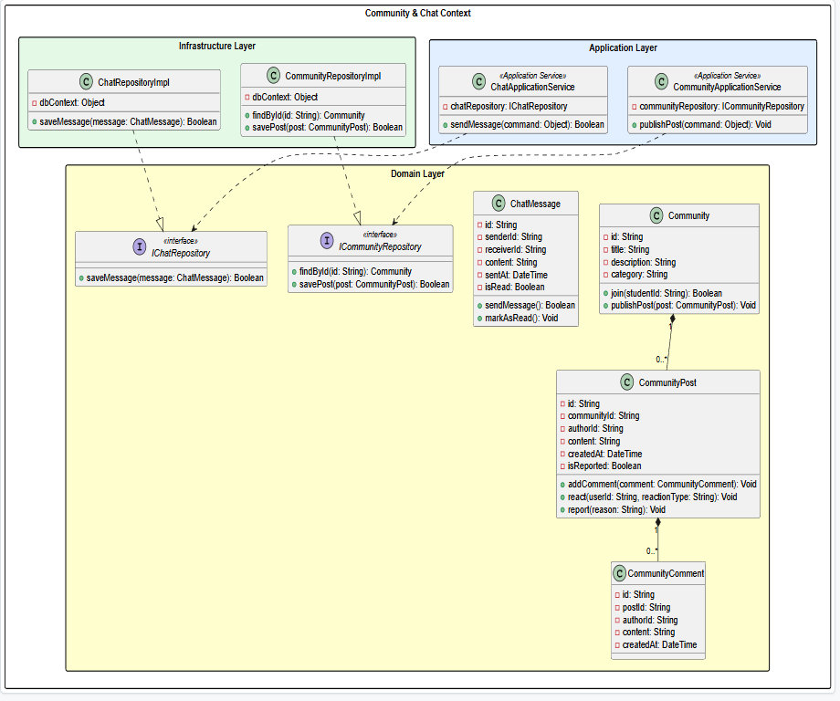<br><br>
</div>

#### 4.7.1.10. System Notifications Context
* **Propósito:** Actúa como servicio transversal reactivo para la generación y despacho de alertas y recordatorios automáticos hacia los usuarios.
* **Capa de Dominio:** Define `NotificationType`, `NotificationStatus`, la entidad `Notification` y el servicio de dominio `NotificationService` que reacciona a eventos de la agenda y del chat.
* **Capa de Aplicación:** `NotificationApplicationService` gestiona la cola de envíos y el estado del despacho de alertas.
* **Capa de Infraestructura:** `NotificationRepositoryImpl` registra el historial y estado de entrega de cada notificación.
<div align="center">
  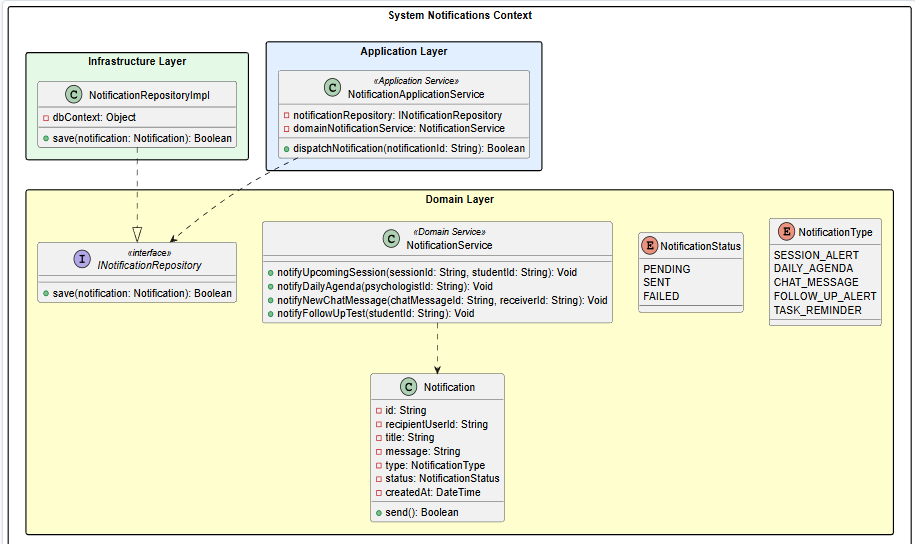<br><br>
</div>

## 4.8. Database Design


### 4.8.1. Database Diagrams


# Capítulo V: Product Implementation, Validation & Deployment

## 5.1. Software Configuration Management

La gestión de configuración del software de NextPath permite organizar y controlar los artefactos generados durante el desarrollo, mantener la trazabilidad de los cambios y facilitar el trabajo colaborativo entre los integrantes del equipo.

Para esta entrega, esta sección documenta las herramientas utilizadas durante el desarrollo del producto, la administración del código fuente, las convenciones adoptadas para mantener la consistencia del código y la configuración utilizada para el despliegue de los productos digitales de NextPath.


5.1.1. Software Development Environment Configuration

El entorno de desarrollo de NextPath ha sido configurado considerando la colaboración entre los integrantes del equipo durante las diferentes etapas del ciclo de vida del producto digital. Para ello, se utilizan herramientas de gestión, diseño, desarrollo, documentación, control de versiones y despliegue que permiten organizar los artefactos y facilitar el trabajo colaborativo.

Las herramientas utilizadas se organizan de acuerdo con las siguientes actividades: Project Management, Requirements Management, Product UX/UI Design, Software Development, Software Deployment y Software Documentation.

Project Management

<table>
<thead>
<tr>
<th>Producto</th>
<th>Propósito</th>
<th>Ruta de referencia</th>
</tr>
</thead>
<tbody>
<tr>
<td>GitHub Projects</td>
<td>Planificación, organización y seguimiento de las actividades, issues, user stories y tareas relacionadas con el desarrollo de NextPath.</td>
<td>https://github.com/features/issues</td>
</tr>
</tbody>
</table>

Requirements Management

<table>
<thead>
<tr>
<th>Producto</th>
<th>Propósito</th>
<th>Ruta de referencia</th>
</tr>
</thead>
<tbody>
<tr>
<td>GitHub Issues</td>
<td>Registro, organización y seguimiento de requerimientos, actividades y problemas identificados durante el desarrollo del proyecto.</td>
<td>https://github.com/features/issues</td>
</tr>
<tr>
<td>Markdown</td>
<td>Elaboración y mantenimiento de documentación estructurada de requerimientos y otros artefactos del proyecto dentro de los repositorios.</td>
<td>https://www.markdownguide.org/</td>
</tr>
</tbody>
</table>

Product UX/UI Design

Para el diseño de la experiencia e interfaz de usuario de NextPath se utilizarán las herramientas establecidas por las indicaciones del proyecto para cada tipo de artefacto.

<table>
<thead>
<tr>
<th>Producto</th>
<th>Propósito</th>
<th>Ruta de referencia</th>
</tr>
</thead>
<tbody>
<tr>
<td>UXPressia</td>
<td>Elaboración de User Personas, Empathy Maps, Journey Maps e Impact Maps para representar las características, necesidades y experiencias de los usuarios.</td>
<td>https://uxpressia.com/</td>
</tr>
<tr>
<td>Figma</td>
<td>Diseño de Wireframes, Mock-ups y Prototypes de las interfaces de NextPath.</td>
<td>https://www.figma.com/</td>
</tr>
<tr>
<td>FigJam</td>
<td>Elaboración colaborativa de Wireflows, User Flows y otros esquemas de interacción.</td>
<td>https://www.figma.com/figjam/</td>
</tr>
<tr>
<td>Miro</td>
<td>Elaboración colaborativa de diagramas y actividades de EventStorming.</td>
<td>https://miro.com/</td>
</tr>
<tr>
<td>Visual Paradigm</td>
<td>Elaboración de diagramas de Software Architecture utilizando el modelo C4.</td>
<td>https://visual-paradigm.com</td>
</tr>
</tbody>
</table>

Software Development

El desarrollo de los productos de software de NextPath contempla diferentes tecnologías de acuerdo con el tipo de producto digital. La Landing Page se desarrolla mediante HTML5, CSS3 y JavaScript. 

<table>
<thead>
<tr>
<th>Producto</th>
<th>Propósito</th>
<th>Ruta de referencia / descarga</th>
</tr>
</thead>
<tbody>
<tr>
<td>Visual Studio Code</td>
<td>Editor de código fuente utilizado para desarrollar y mantener los productos de software del proyecto.</td>
<td>https://code.visualstudio.com/</td>
</tr>
<tr>
<td>HTML5</td>
<td>Lenguaje de marcado utilizado para estructurar el contenido de la Landing Page y las interfaces web.</td>
<td>https://developer.mozilla.org/en-US/docs/Web/HTML</td>
</tr>
<tr>
<td>CSS3</td>
<td>Lenguaje utilizado para definir la presentación visual, estilos y comportamiento responsive de las interfaces.</td>
<td>https://developer.mozilla.org/en-US/docs/Web/CSS</td>
</tr>
<tr>
<td>JavaScript</td>
<td>Lenguaje utilizado para implementar la interacción y comportamiento dinámico de las interfaces web.</td>
<td>https://developer.mozilla.org/en-US/docs/Web/JavaScript</td>
</tr>
<tr>
<td>GitHub Pages</td>
<td>Servicio utilizado para realizar el deployment de la Landing Page desarrollada con HTML5, CSS3 y JavaScript.</td>
<td>https://pages.github.com/</td>
</tr>
<tr>
<td>GitHub</td>
<td>Repositorio y plataforma utilizada como fuente del código para los procesos de integración, colaboración y deployment.</td>
<td>https://github.com/</td>
</tr>
</tbody>
</table>

### 5.1.2. Source Code Management

Para la gestión del código fuente de NextPath se utilizará **Git** como sistema de control de versiones y **GitHub** como plataforma para el almacenamiento remoto de los repositorios, colaboración entre los integrantes del equipo y gestión de las diferentes versiones del proyecto.

El control de versiones permitirá mantener un historial de cambios, trabajar de manera paralela mediante ramas, integrar las funcionalidades desarrolladas y mantener versiones estables de los diferentes productos de software.

GitHub Repositories

Los diferentes productos que forman parte de NextPath se gestionarán mediante repositorios independientes, permitiendo mantener organizado el código correspondiente a cada producto.

<table>
<thead>
<tr>
<th>Producto</th>
<th>Repositorio</th>
<th>Propósito</th>
</tr>
</thead>
<tbody>
<tr>
<td>Project Report</td>
<td>VocaFyTeam/NextPath-Report</td>
<td>Almacenar la documentación y los artefactos correspondientes al Project Report de NextPath.</td>
</tr>
<tr>
<td>Landing Page</td>
<td>VocaFy Team/NextPath-Landing-Page</td>
<td>Almacenar el código fuente de la Landing Page desarrollada con HTML5, CSS3 y JavaScript.</td>
</tr>
</tbody>
</table>

**Project Report Repository:**

https://github.com/VocaFyTeam/NextPath-Report

**Landing Page Repository:**

https://github.com/VocaFyTeam/NextPath-LandingPage

GitFlow

Para organizar el desarrollo colaborativo se utilizará una estrategia de ramas basada en **GitFlow**. Esta estrategia permite separar el desarrollo de nuevas funcionalidades de las versiones estables del proyecto.

La estructura principal de ramas será:

<table>
<thead>
<tr>
<th>Rama</th>
<th>Propósito</th>
<th>Ejemplo</th>
</tr>
</thead>
<tbody>
<tr>
<td><code>main</code></td>
<td>Contiene las versiones estables y listas para producción de los productos de software.</td>
<td><code>main</code></td>
</tr>
<tr>
<td><code>develop</code></td>
<td>Rama principal de integración donde se incorporan las funcionalidades desarrolladas antes de generar una versión estable.</td>
<td><code>develop</code></td>
</tr>
<tr>
<td><code>feature/&lt;name&gt;</code></td>
<td>Ramas utilizadas para desarrollar nuevas funcionalidades o realizar cambios específicos.</td>
<td><code>feature/landing-page</code></td>
</tr>
<tr>
<td><code>release/&lt;version&gt;</code></td>
<td>Ramas utilizadas para preparar una nueva versión estable del producto.</td>
<td><code>release/1.0.0</code></td>
</tr>
</tbody>
</table>

### 5.1.3. Source Code Style Guide & Conventions
  Para garantizar coherencia, legibilidad y mantenibilidad en la Landing Page de NextPath, el equipo adopta convenciones de estilo para HTML, CSS y JavaScript. Los identificadores y comentarios del código se mantienen consistentes dentro del repositorio.


  HTML & CSS
  - Uso de minúsculas para nombres de elementos y atributos HTML.
  - Uso de comillas dobles para los atributos.
  - Indentación consistente de 2 espacios.
  - Clases CSS con nomenclatura kebab-case, por ejemplo `pricing-card` o `hero-section`.
  - Evitar estilos inline y centralizar los estilos en archivos CSS.
  - Incluir el atributo `alt` en las imágenes para favorecer la accesibilidad.
  - Aplicar media queries para adaptar la interfaz a desktop, tablet y mobile.


  JavaScript
  - Uso de `const` para variables que no se reasignan y `let` cuando el valor puede cambiar.
  - Nombres de variables y funciones en camelCase.
  - Nombres de clases y constructores en PascalCase cuando corresponda.
  - Evitar el uso de `var`.
  - Mantener funciones y eventos con responsabilidades claras.
  - Usar punto y coma de manera consistente.


  Gherkin (Acceptance Criteria)
  - Uso de Given, When, Then y And en inglés.
  - Una sola acción principal por paso When.
  - Escenarios con nombres descriptivos del comportamiento esperado.
  - Uso de tablas Gherkin cuando sea necesario representar datos de ejemplo.


  Conventional Commits
  Todos los mensajes de commit del proyecto deben seguir la especificación de Conventional Commits.


### 5.1.4. Software Deployment Configuration

El deployment de NextPath contempla la publicación de los productos de software que forman parte de la solución: Landing Page.

La configuración de deployment permite trasladar los productos desarrollados desde el entorno de desarrollo hacia un entorno accesible para los usuarios, verificando previamente su funcionamiento y disponibilidad.
Landing Page Deployment

La Landing Page de NextPath está desarrollada utilizando **HTML5, CSS3 y JavaScript**. Debido a que se trata de una aplicación web estática, su publicación se realiza mediante **GitHub Pages**.

El proceso de deployment comprende las siguientes actividades:

1. Mantener el código fuente de la Landing Page en su repositorio de GitHub.
2. Verificar que los archivos HTML, CSS, JavaScript, imágenes y demás recursos necesarios se encuentren correctamente organizados.
3. Realizar las pruebas correspondientes en el entorno local.
4. Realizar el commit de los cambios utilizando la convención de **Conventional Commits**.
5. Realizar el push de los cambios hacia el repositorio remoto.
6. Configurar GitHub Pages como mecanismo de publicación.
7. Seleccionar la rama correspondiente para el deployment.
8. Seleccionar la carpeta que contiene los archivos que serán publicados.
9. Esperar la generación del sitio por parte de GitHub Pages.
10. Acceder a la URL pública generada.
11. Verificar el funcionamiento de las secciones, enlaces, imágenes y estilos.
12. Verificar el comportamiento responsive de la Landing Page en diferentes tamaños de pantalla.

Landing Page Production Environment

<table>
<thead>
<tr>
<th>Configuración</th>
<th>Valor</th>
</tr>
</thead>
<tbody>
<tr>
<td>Product</td>
<td>Landing Page</td>
</tr>
<tr>
<td>Technology</td>
<td>HTML5, CSS3, JavaScript</td>
</tr>
<tr>
<td>Repository</td>
<td>VocaFy TeamTeam/NextPath-Landing-Page</td>
</tr>
<tr>
<td>Deployment Platform</td>
<td>GitHub Pages</td>
</tr>
<tr>
<td>Deployment Type</td>
<td>Static Web Hosting</td>
</tr>
<tr>
<td>Production URL</td>
<td>https://vocafyteam.github.io/NextPath-LandingPage/</td>
</tr>
</tbody>
</table>

**Production URL:**

https://vocafyteam.github.io/NextPath-LandingPage/

Deployment Configuration Summary

<table>
<thead>
<tr>
<th>Product</th>
<th>Technology</th>
<th>Deployment Platform</th>
<th>Repository</th>
<th>Production URL</th>
</tr>
</thead>
<tbody>
<tr>
<td>Landing Page</td>
<td>HTML5, CSS3, JavaScript</td>
<td>GitHub Pages</td>
<td>VocaFy TeamTeam/NextPath-Landing-Page</td>
<td>https://vocafyteam.github.io/NextPath-LandingPage/</td>
</tr>
</tbody>
</table>

## 5.2. Landing Page, Services & Applications Implementation

### 5.2.1. Sprint 1

#### 5.2.1.1. Sprint Planning 1

El Sprint Planning 1 tuvo como objetivo principal completar, maquetar y desplegar la Landing Page del proyecto NextPath, estableciendo así la presencia digital inicial de la plataforma orientada a la orientación vocacional estudiantil y el acompañamiento profesional.

Durante este sprint, el equipo definió las tareas técnicas necesarias para implementar la estructura visual responsive a partir de HTML5, CSS3 y JavaScript, asegurando una experiencia de usuario fluida, limpia y alineada a las guías de estilo de la marca (paleta basada en verde petróleo y la integración de la mascota Panda). Asimismo, se configuró el repositorio oficial en GitHub y la integración continua para el despliegue automático en la plataforma Netlify.

Entre las actividades principales planificadas se incluyeron:
* Implementación de la barra de navegación fija (*Navbar*) con accesos directos (*Inicio*, *Sobre nosotros*, *Cómo funciona*, *Comenzar ahora*, *Contáctanos*).
* Desarrollo de la sección **Hero Banner / Inicio** con el lema *"Conviértete en un profesional"* y botón principal de llamado a la acción (*CTA*).
* Maquetación de la sección **Sobre nosotros** destacando el enfoque de autoconocimiento asistido por IA e identidad visual corporativa.
* Construcción de la sección interactiva **¿Cómo funciona?** estructurada en tres tarjetas secuenciales (*Descúbrete*, *Conecta*, *Traza tu plan*).
* Desarrollo del bloque de conversión **Comenzar ahora** con enlaces hacia tiendas móviles (*App Store*, *Google Play*) acompañado de la mascota institucional Panda.
* Creación del pie de página **Contáctanos** con enlaces a redes sociales oficiales (*Instagram*, *Facebook*, *LinkedIn*) y derechos reservados.
* Ajustes de estilos CSS y validación de diseño responsive para pantallas de escritorio y dispositivos móviles.
* Configuración del flujo de despliegue continuo mediante Netlify.

| Campo | Detalle |
| :--- | :--- |
| **Sprint #** | Sprint 1 |
| **Sprint Planning Background** | En este sprint se aborda el desarrollo de la Landing Page de NextPath utilizando HTML5, CSS3 y JavaScript puro, a partir de los wireframes y mockups de alta fidelidad previamente diseñados. El objetivo es construir una primera versión funcional del sitio web público que comunique la propuesta de valor del producto, explique la metodología de evaluación vocacional, presente la identidad de marca y habilite canales de captación de usuarios interesados. |
| **Date** | 2026/09/07 |
| **Time** | 6:00 PM |
| **Location** | Reunión virtual mediante la plataforma Google Meet |
| **Prepared By** | Equipo NextPath |
| **Attendees (to planning meeting)** | [Nombres de los integrantes de tu equipo] |
| **Sprint 0 Review Summary** | Durante el Sprint 0 se completó la fase de investigación, definición de arquitectura base (modelo C4) y especificación de requerimientos del sistema. Se definieron las épicas, historias de usuario y prototipos de alta fidelidad, permitiendo al equipo iniciar la fase de implementación de la Landing Page con especificaciones claras de UI/UX. |
| **Sprint 0 Retrospective Summary** | El equipo demostró sincronización y compromiso técnico en el Sprint 0; no obstante, se identificó la necesidad de reforzar la gestión de ramas bajo GitFlow y la coordinación en la integración de estilos para evitar conflictos en el desarrollo colaborativo del código frontend. |
| **Sprint 1 Goal** | Desarrollar, maquetar e implementar completamente la Landing Page institucional de NextPath y realizar su despliegue continuo. El resultado permitirá dar a conocer la solución, explicar el proceso de orientación vocacional asistida por IA y captar el interés tanto de estudiantes como de psicólogos orientadores. Esto se validará cuando las secciones de Inicio, Sobre nosotros, Cómo funciona, Comenzar ahora y Contáctanos se encuentren completamente publicadas y accesibles vía web. |
| **Sprint 1 Velocity** | 10 |
| **Sum of Story Points** | 9 |

#### 5.2.1.2. Aspect Leaders and Collaborators

A continuación, se presenta la matriz LACX (*Leadership-and-Collaboration Matrix*) para la asignación de responsabilidades de maquetación y desarrollo de la Landing Page de NextPath:

| Team Member | GitHub Username | [US01 • Hero + Propuesta de valor] | [US02 • Sobre nosotros + Identidad] | [US03 • ¿Cómo funciona? + Proceso] | [US04 • Comenzar ahora + Call to Action] | [US05 • Contáctanos + Footer] |
| :--- | :--- | :---: | :---: | :---: | :---: | :---: |
| Pérez, Sebastián | FernBellido22 | **L** | C | C | C | C |
| Cruzalegui, Joaquin | JoaquinCruzalegui | C | **L** | C | C | C |
| Ravello, Luciana | Lucyrcar-ID | C | C | **L** | C | C |
| Miranda, Jesús | Jesus-Miranda-678 | C | C | C | **L** | C |
| Torres, Alisee | lLisee1 | C | C | C | C | **L** |

> **L** = Leader | **C** = Collaborator

#### 5.2.1.3. Sprint Backlog 1

**Objetivo del Sprint:** Publicar la landing page funcional de NextPath que comunique la propuesta de valor de orientación vocacional asistida por IA, permita a estudiantes y psicólogos conocer la plataforma y habilite los primeros canales de captación y contacto — convirtiendo visitantes en usuarios potenciales registrados[cite: 9, 10, 18].

**Sprint Goal:** *Un estudiante o psicólogo educativo puede ingresar a la landing page, comprender qué resuelve NextPath, explorar cómo funciona el proceso vocacional guiado, interactuar con el llamado a la acción y acceder a los canales de contacto — todo de manera fluida y responsive[cite: 9, 10, 18].*

**Story Points comprometidos: 9 SP | Duración: 2 semanas | Stack: HTML5 / CSS3 / JavaScript vanilla**[cite: 9, 10]

| Sprint # | User Story ID | User Story Título | SP | Work-Item / Task ID | Task Título | Descripción | Estimación | Asignado a | Status |
| :--- | :--- | :--- | :---: | :--- | :--- | :--- | :---: | :--- | :---: |
| Sprint 1 | US01 | Comunicar propuesta de valor para captar postulantes y orientadores | 2 | T01 | Maquetar Hero section | Diseñar y maquetar hero section con HTML y CSS puro: titular principal ("Conviértete en un profesional"), subtítulo descriptivo enfocado en autoconocimiento vocacional y botón CTA ("Comenzar") visible above the fold. | 4h | Sebastián Pérez | Done |
| Sprint 1 | US01 | Comunicar propuesta de valor para captar postulantes y orientadores | 2 | T02 | Implementar navegación del CTA principal | Configurar evento click en el botón CTA mediante JavaScript vanilla para ejecutar un desplazamiento suave directo hacia la sección de conversión 'Comenzar ahora'. | 2h | Sebastián Pérez | Done |
| Sprint 1 | US01 | Comunicar propuesta de valor para captar postulantes y orientadores | 2 | T03 | Validar diseño responsive en Hero | Validar breakpoints en mobile (375px), tablet (768px) y desktop (1280px), verificando alineación de textos y adaptabilidad de la imagen de fondo educativo sin cortes visuales. | 2h | Sebastián Pérez | Done |
| Sprint 1 | US02 | Presentar identidad de marca y enfoque vocacional con IA | 2 | T04 | Maquetar sección Sobre nosotros | Construir contenedor en HTML5 y estilos CSS para presentar la misión de NextPath, integrando texto explicativo sobre IA y autoconocimiento junto al logotipo oficial de marca. | 3h | Joaquin Cruzalegui | Done |
| Sprint 1 | US02 | Presentar identidad de marca y enfoque vocacional con IA | 2 | T05 | Integrar componentes gráficos de marca | Incorporar elementos SVG de la identidad corporativa y optimizar la disposición flexbox/grid para mantener balance y legibilidad en diferentes resoluciones. | 2h | Joaquin Cruzalegui | Done |
| Sprint 1 | US03 | Explicar el funcionamiento secuencial del acompañamiento vocacional | 1 | T06 | Maquetar tarjetas explicativas de proceso | Maquetar tres cards modulares ('Descúbrete', 'Conecta', 'Traza tu plan') con HTML y CSS, asociando cada una a su ícono temático y descripción del flujo paso a paso. | 3h | Luciana Ravello | Done |
| Sprint 1 | US03 | Explicar el funcionamiento secuencial del acompañamiento vocacional | 1 | T07 | Añadir efectos de interacción en cards | Implementar microinteracciones en CSS (:hover, transiciones suaves de escala y elevación de sombras) para destacar cada paso de la metodología al pasar el cursor. | 2h | Luciana Ravello | Done |
| Sprint 1 | US04 | Presentar llamado a la acción y disponibilidad de acceso | 2 | T08 | Maquetar tarjeta de conversión y mascota Panda | Maquetar contenedor central con la ilustración oficial de la mascota Panda de NextPath, mensaje motivacional y botones de acceso/descarga ('App Store' y 'Google Play'). | 3h | Jesús Miranda | Done |
| Sprint 1 | US04 | Presentar llamado a la acción y disponibilidad de acceso | 2 | T09 | Configurar interactividad de botones de acceso | Añadir lógica en JavaScript para gestionar eventos de clic en los botones de acceso, configurando redirecciones consistentes o retroalimentación accesible al usuario. | 2h | Jesús Miranda | Done |
| Sprint 1 | US05 | Proveer canales de contacto y pie de página institucional | 2 | T10 | Maquetar sección de contacto y pie institucional | Maquetar bloque inferior con fondo verde petróleo, título 'Contáctanos', botones hacia redes sociales y franja de copyright 2026. | 3h | Alisee Torres | Done |
| Sprint 1 | US05 | Proveer canales de contacto y pie de página institucional | 2 | T11 | Configurar hipervínculos de comunidades oficiales | Enlazar botones con accesos externos a perfiles oficiales (Instagram, Facebook, LinkedIn) configurando atributos de apertura segura `target="_blank"` y `rel="noopener noreferrer"`. | 2h | Alisee Torres | Done |
| Sprint 1 | — | Setup del proyecto | — | T12 | Estructuración base del repositorio web | Crear estructura de carpetas (`css/`, `js/`, `assets/img/`, `assets/icons/`) y archivos base (`index.html`, `styles.css`, `main.js`), verificando enlace libre de errores en consola. | 2h | Sebastián Pérez | Done |
| Sprint 1 | — | Setup del proyecto | — | T13 | Configuración de variables CSS y tokens | Declarar en `:root` de CSS la paleta de colores oficial (verde petróleo, fondos oscuros, textos neutros), tipografías, variables de espaciado y breakpoints responsive. | 2h | Sebastián Pérez | Done |
| Sprint 1 | — | Setup del proyecto | — | T14 | Configuración de navegación y smooth scrolling | Implementar en JavaScript vanilla o CSS nativo el desplazamiento suave (*smooth scroll*) al hacer clic en los enlaces del Navbar hacia sus respectivas secciones ancla. | 1h | Sebastián Pérez | Done |
| Sprint 1 | — | Setup del proyecto | — | T15 | Auditoría de accesibilidad y despliegue continuo | Validar contrastes de color, textos alternativos, etiquetas semánticas y configurar el despliegue automático del repositorio mediante Netlify. | 2h | Team | Done |

#### 5.2.1.4. Development Evidence for Sprint Review

En esta sección se muestran las pruebas de desarrollo del Sprint actual, centradas en la creación de la Landing Page de NextPath para el producto VocaFy. En esta etapa, se dio prioridad a construir la estructura web principal y a organizar los directorios del proyecto. También trabajamos en mejorar la experiencia de usuario y la interfaz, cambiando los estilos visuales, haciendo que el menú de navegación fuera más fácil de usar y ajustando cómo se cargan los scripts. Por último, se definió la identidad de marca al integrar recursos gráficos importantes. Así logramos una primera versión atractiva y funcional, pensada para atraer a personas que buscan orientación vocacional.


<table>
  <thead>
    <tr>
      <th width="20%">Repository</th>
      <th width="10%">Branch</th>
      <th width="10%">Commit Id</th>
      <th width="30%">Commit Message</th>
      <th width="15%">Commit Message Body</th>
      <th width="15%">Commited on (Date)</th>
    </tr>
  </thead>
  <tbody>
    <tr>
      <td>NextPath - LandingPage</td>
      <td>main</td>
      <td>01af248</td>
      <td>feat: add initial landing page</td>
      <td>-</td>
      <td>11/09/2026</td>
    </tr>
    <tr>
      <td>NextPath - LandingPage</td>
      <td>main</td>
      <td>293bfa4</td>
      <td>feat: new folder creation</td>
      <td>-</td>
      <td>11/09/2026</td>
    </tr>
    <tr>
      <td>NextPath - LandingPage</td>
      <td>main</td>
      <td>c5084fe</td>
      <td>fix: we fix the landing style</td>
      <td>-</td>
      <td>15/09/2026</td>
    </tr>
    <tr>
      <td>NextPath - LandingPage</td>
      <td>main</td>
      <td>fe48a0b</td>
      <td>fix: adjust scripts and images</td>
      <td>-</td>
      <td>16/09/2026</td>
    </tr>
    <tr>
      <td>NextPath - LandingPage</td>
      <td>main</td>
      <td>be6b5bf</td>
      <td>feat: add logo on browser tab</td>
      <td>-</td>
      <td>16/09/2026</td>
    </tr>
    <tr>
      <td>NextPath - LandingPage</td>
      <td>main</td>
      <td>7a7d051</td>
      <td>fix: adjustment of the nav toggle</td>
      <td>-</td>
      <td>16/09/2026</td>
    </tr>
    <tr>
      <td>NextPath - LandingPage</td>
      <td>main</td>
      <td>f25101c</td>
      <td>fix: change logo and panda images</td>
      <td>-</td>
      <td>17/09/2026</td>
    </tr>
  </tbody>
</table>

<br><br>

#### 5.2.1.5. Execution Evidence for Sprint Review

#### 5.2.1.6. Services Documentation Evidence for Sprint Review

Durante el Sprint 1, el alcance del equipo de desarrollo de NextPath se focalizó exclusivamente en la maquetación, estilos y despliegue del Frontend correspondiente a la Landing Page (utilizando HTML5, CSS3 y JavaScript). 

Por lo tanto, en este primer ciclo no se construyeron ni desplegaron servicios de backend (APIs) ni endpoints funcionales de lógica de negocio. La implementación de los servicios del servidor y la conexión a las bases de datos comenzarán a desarrollarse a partir del Sprint 2.

#### 5.2.1.7. Software Deployment Evidence for Sprint Review
El despliegue de la primera versión de la Landing Page de NextPath se realizará mediante GitHub Pages, siempre que esta sea la configuración efectivamente utilizada por el equipo. La evidencia debe demostrar la configuración de Pages y el acceso a la URL pública.

<table>
<thead>
<tr>
<th>Evidencia</th>
<th>Dato real</th>
</tr>
</thead>
<tbody>
<tr>
<td>Repositorio</td>
<td>https://github.com/VocaFyTeam/NextPath-LandingPage</td>
</tr>
<tr>
<td>Branch de despliegue</td>
<td>main/root</td>
</tr>
<tr>
<td>URL pública</td>
<td>https://vocafyteam.github.io/NextPath-LandingPage/</td>
</tr>
<tr>
<td>Fecha de despliegue</td>
<td>2026-09-18</td>
</tr>
</tbody>
</table>

- Configuración de GitHub Pages del repositorio.
<div align="center">
  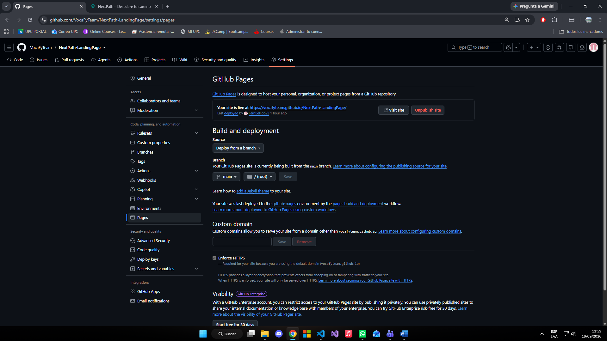
</div>

- Landing Page funcionando en la URL pública.
https://vocafyteam.github.io/NextPath-LandingPage/

- Vista responsive o prueba desde un dispositivo móvil.
<div align="center">
  
</div>

#### 5.2.1.8. Team Collaboration Insights during Sprint


Durante el Sprint 1, el equipo trabajó de manera colaborativa para desarrollar la primera versión funcional de la Landing Page de NextPath. La organización del trabajo se gestionó distribuyendo las responsabilidades entre los cinco integrantes del equipo y utilizando GitHub como plataforma central para administrar el código fuente y coordinar la integración de los cambios.   

El desarrollo de la Landing Page se llevó a cabo de forma incremental, asignando líderes y colaboradores (según la matriz LACX) para las distintas secciones estructurales del producto, tales como Hero & Propuesta de valor, Sobre nosotros & Identidad, ¿Cómo funciona?, Comenzar ahora & Call to Action, y la sección de Contáctanos & Footer. Esto aseguró que todos los miembros del equipo tuvieran una participación activa y equitativa en la implementación de este primer entregable.   

Además, el equipo empleó una estrategia de ramificación (Branching) basada en GitFlow, creando ramas específicas (feature/) para programar las interfaces y funcionalidades de manera aislada antes de integrarlas al flujo principal del proyecto. Esta dinámica permitió mantener una separación limpia entre las distintas secciones de código (HTML5, CSS3 y JavaScript) durante su construcción y facilitó su posterior integración.   

Durante el Sprint también se utilizaron mensajes de commit bajo el estándar de Conventional Commits para registrar los cambios en el repositorio. Los commits permitieron mantener la trazabilidad de las secciones integradas (feat:) y de las correcciones de estilos o maquetación realizadas (fix:) durante el desarrollo de la Landing Page.

<table>
  <thead>
    <tr>
      <th width="25%">Aspect</th>
      <th>Collaboration Practice</th>
    </tr>
  </thead>
  <tbody>
    <tr>
      <td valign="top"><b>Task Distribution</b></td>
      <td>Las actividades del Sprint 1 fueron distribuidas entre los cinco integrantes de acuerdo con los requerimientos específicos de la Landing Page.</td>
    </tr>
    <tr>
      <td valign="top"><b>Version Control</b></td>
      <td>Se utilizó Git y GitHub para gestionar las diferentes versiones del código fuente.</td>
    </tr>
    <tr>
      <td valign="top"><b>Branching</b></td>
      <td>Se utilizaron ramas (feature/) para desarrollar secciones específicas antes de integrarlas al flujo principal (main) del proyecto.</td>
    </tr>
    <tr>
      <td valign="top"><b>Commits</b></td>
      <td>Se registraron los cambios mediante commits descriptivos (estándar Conventional Commits) para mantener la trazabilidad del desarrollo.</td>
    </tr>
    <tr>
      <td valign="top"><b>Integration</b></td>
      <td>Los avances desarrollados fueron integrados mediante el flujo de trabajo establecido para el repositorio central de la Landing Page.</td>
    </tr>
    <tr>
      <td valign="top"><b>Deployment</b></td>
      <td>El equipo coordinó la configuración y validación del despliegue de la Landing Page estática mediante GitHub Pages.</td>
    </tr>
  </tbody>
</table>

<br>

## 5.3. Validation Interviews

### 5.3.1. Diseño de Entrevistas

### 5.3.2. Registro de Entrevistas

### 5.3.3. Evaluaciones según heurísticas

## 5.4. Video About-the-Product


# Conclusiones

## Conclusiones
- El análisis y desarrollo del proyecto demuestra que la desinformación y la utilización exclusiva de pruebas vocacionales genéricas son factores críticos que limitan que los jóvenes tomen decisiones informadas. Con nuestra  propuesta, solucionamos eficientemente este problema clave, proporcionando un entorno que reúne evaluaciones personalizadas y datos del mercado laboral, disminuyendo así la incertidumbre en los estudiantes.
-  Las validaciones confirmaron que los estudiantes no solo busca descubrir su perfil, sino que valora enormemente la simulación de trayectorias profesionales para proyectar su futuro. Por otro lado, los psicólogos educativos validaron nuestra premisa sobre su limitación de tiempo y recursos; destacando que perciben nuestra aplicación como una herramienta de apoyo complementaria y no como un reemplazo de su labor profesional.
- Las validaciones tempranas respaldaron nuestras hipótesis principales, demostrando que la solución tiene una alta viabilidad para alcanzar las métricas establecidas en el proceso Lean UX. La retroalimentación obtenida proyecta que la herramienta logrará una alta valoración de utilidad por parte de los usuarios (apuntando al 80% de satisfacción esperada), facilitará la reducción del tiempo de evaluación para los psicólogos (acercándonos a la meta del 30% de optimización), y brindará a los estudiantes la confianza necesaria mediante simulaciones, encaminándonos a alcanzar el 70% de seguridad proyectada en su decisión vocacional.

## Recomendaciones

- **Desarrollo del Core de la Web Application:** Tras la implementación de la Landing Page en este primer Sprint, el siguiente paso es desarrollar el flujo principal de las Web Applications. Esto incluye la programación del registro de usuarios, los paneles de control (dashboards) diferenciados para estudiantes y psicólogos, y la interfaz de los tests vocacionales.
- **Integración de Web Services y Motores de IA:** Se recomienda priorizar la construcción de los Web Services que conectarán el frontend con la base de datos y los modelos de Inteligencia Artificial responsables de analizar las variables cognitivas y emocionales. Asimismo, se debe planificar la integración de APIs externas que provean información actualizada sobre el mercado laboral para alimentar las simulaciones de trayectorias.   
- **Ejecución de Pruebas Piloto y Medición de Métricas**: Una vez desplegado el MVP completo, se recomienda ejecutar el periodo piloto de 2 meses con psicólogos y las 8 semanas de prueba beta con estudiantes. Esto permitirá recolectar datos cuantitativos reales para iterar la plataforma según las verdaderas necesidades de los segmentos objetivo antes de un lanzamiento comercial.

## Video About-the-Team

# Bibliografía

# Anexos